### 2.2. Архитектура библиотеки

#### 2.2.1. Высокоуровневое описание архитектуры
Сформированные требования диктуют и архитектуру системы. Ключевым решением является то, что библиотека создана для реализации именно хореографических саг.

Выбор хореографии обусловлен следующей причиной. Как было описано ранее, одним из функциональных требований является лёгкость внедрения: хореографическая сага позволяет использовать уже существующую систему без внедрения дополнительного узла координатора и без навязывания отдельной платформы исполнения, что соответствует требованию легковесности.

Однако это накладывает и определённые ограничения. Библиотека будет полезна только для систем, которые уже используют событийно-ориентированное взаимодействие или могут быть естественным образом к нему адаптированы, то есть тех систем, в которых уже настроен брокер сообщений. В ином случае придется разворачивать этот узел, так как от брокера зависит координация сообщений и их асинхронная доставка. Кроме того, вместе с преимуществами хореографии библиотека наследует и ее характерные сложности, которые были описаны в анализе предметной области: 
 1. отсутствие единой точки управления
 2. необходимость идемпотентной обработки
 3. зависимость от надежности обмена сообщениями и более сложное восстановление после частичных отказов. 
 
 Тем не менее именно такой компромисс позволяет реализовать распределенную транзакцию как легковесную библиотеку.

#### 2.2.2. Инверсия управления

В основе архитектуры библиотеки лежит принцип инверсии управления. По такому принципу часто строят различные фреймворки, например Django, Spring, его идея в том, что пользователь не управляет вручную всем жизненным циклом выполнения распределенного шага, а передает библиотеке контроль над инфраструктурной частью процесса. В случае данного продукта этот принцип раскрывается так: разработчик описывает бизнес-логику шага, компенсационное действие, структуру сообщений и прикладную реакцию на ошибки, тогда как библиотека берет на себя координацию выполнения, связанную с приемом входящего сообщения, обеспечением идемпотентности, запуском шага в транзакции.

#### 2.2.3. Построение API
Пользовательский интерфейс библиотеки строится вокруг ограниченного набора абстракций, через которые описывается выполнение распределенного процесса. Они формируют API библиотеки. Ключевыми сущностями являются:
  * "Saga" (сага)
  * "Step" (шаг)
  * "Action" (действие)
  * "Message" (сообщение)
  * "Executor" (исполнитель)

* "Saga" в коде представлена одноименным интерфейсом верхнего уровня. Эта абстракция задает минимальный API управления выполнением саги: 
    * Метод "Register" - регистрация шага на входящем топике
    * Метод "StartSaga" - запуск новой саги, если сервис начинает сагу. 

В библиотеке этот интерфейс имплементируется через "Controller". Эта сущность выступает внешней точкой входа в библиотеку, через который пользователь конфигурирует библиотеку и передает ей управление обработкой сообщений.

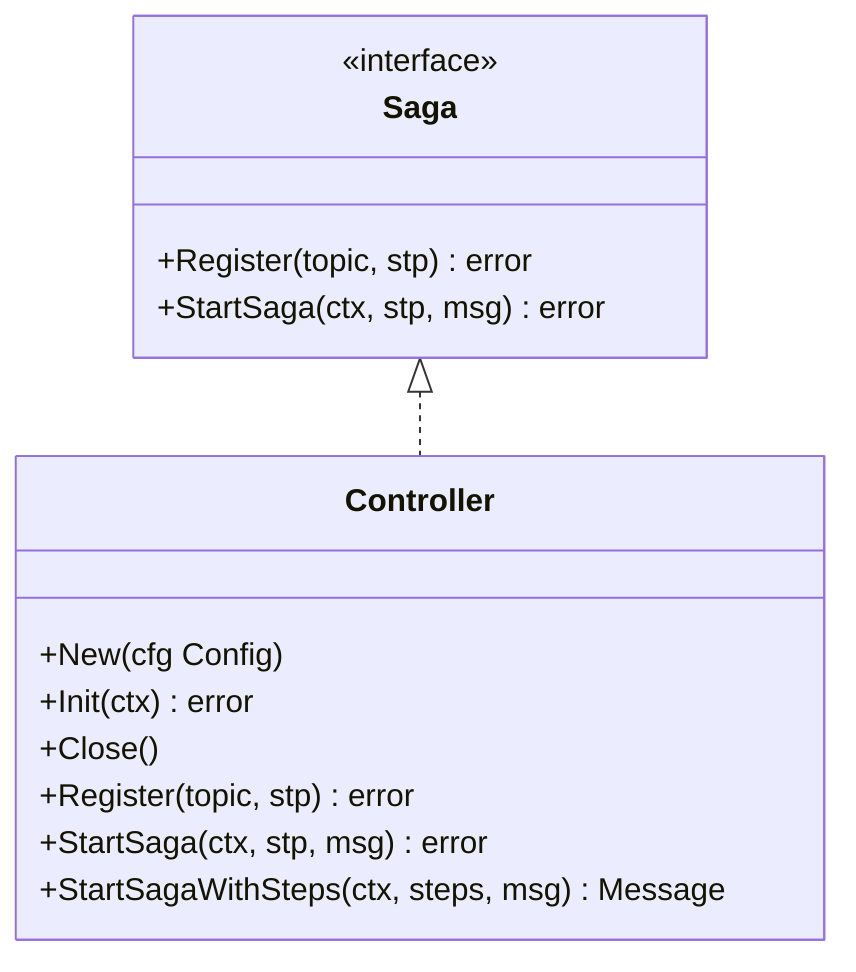
```mermaid
classDiagram
    direction TB

    class Saga {
        <<interface>>
        +Register(topic, stp) error
        +StartSaga(ctx, stp, msg) error
    }

    class Controller {
        +New(cfg Config)
        +Init(ctx) error
        +Close()
        +Register(topic, stp) error
        +StartSaga(ctx, stp, msg) error
        +StartSagaWithSteps(ctx, steps, msg) Message
    }


    Saga <|.. Controller
```

* Одной из центральных абстракций является "Step": 
Представляет собой структуру, в которой пользователь описывает бизнес-логику шага распределённой транзакции. Шаг регистрируется на определённом входящем топике через интерфейс `Saga`, а также в нём указываются топики, в которые будут отправлены сообщения при ошибке (топики компенсации) или при успешном исходе шага (топики для следующих шагов). Описывая маршрутизацию, можно строить гибкие пути между сервисами.

Структура шага и связанные с ней абстракции показаны на UML-диаграмме ниже.

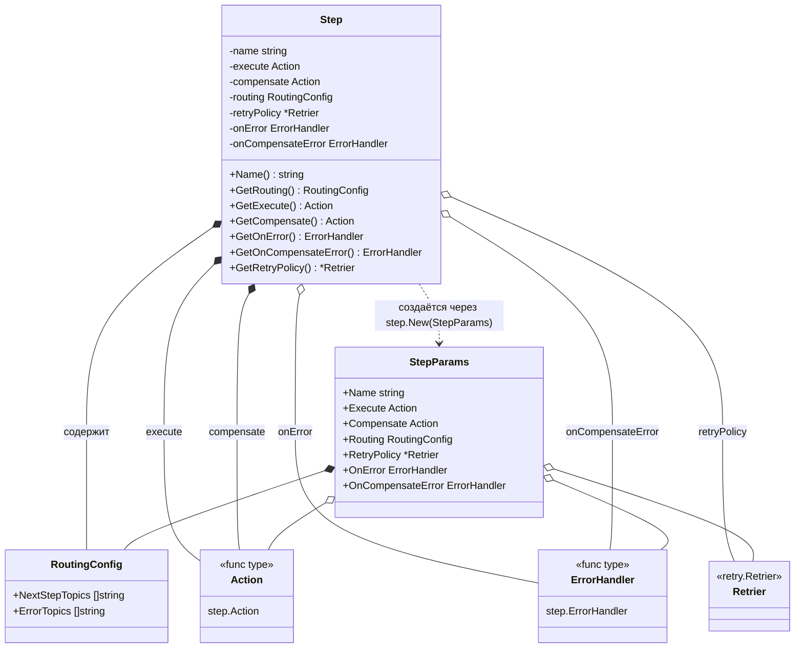
```mermaid
classDiagram
    direction TB

    class Step {
        -name string
        -execute Action
        -compensate Action
        -routing RoutingConfig
        -retryPolicy *Retrier
        -onError ErrorHandler
        -onCompensateError ErrorHandler
        +Name() string
        +GetRouting() RoutingConfig
        +GetExecute() Action
        +GetCompensate() Action
        +GetOnError() ErrorHandler
        +GetOnCompensateError() ErrorHandler
        +GetRetryPolicy() *Retrier
    }

    class StepParams {
        +Name string
        +Execute Action
        +Compensate Action
        +Routing RoutingConfig
        +RetryPolicy *Retrier
        +OnError ErrorHandler
        +OnCompensateError ErrorHandler
    }

    class RoutingConfig {
        +NextStepTopics []string
        +ErrorTopics []string
    }

    class Action {
        <<func type>>
        step.Action
    }

    class ErrorHandler {
        <<func type>>
        step.ErrorHandler
    }

    class Retrier {
        <<retry.Retrier>>
    }

    Step *-- RoutingConfig : содержит
    Step *-- Action : execute
    Step *-- Action : compensate
    Step o-- ErrorHandler : onError
    Step o-- ErrorHandler : onCompensateError
    Step o-- Retrier : retryPolicy

    StepParams *-- RoutingConfig
    StepParams o-- Action
    StepParams o-- ErrorHandler
    StepParams o-- Retrier

    Step ..> StepParams : создаётся через step.New(StepParams)
```

* Сущность `Action` (действие) представляет собой тип функций, которыми оперирует шаг. Бизнес-действие описывается пользователем в соответствии с сигнатурой, которую задаёт `Action`: именно в этой функции пользователь описывает операции, выполняемые в рамках локальной транзакции или компенсации. Для `Step` `Action` является единицей действия и диктует пользователю дизайн бизнес-шага.

Go позволяет создавать пользовательские типы на основе встроенного типа функции. Чтобы использовать `Action`, пользователь реализует функцию с требуемой сигнатурой и помещает её внутри шага.
    type Action func(ctx context.Context, tx database.TxQueryer, msg message.Message) (message.Message, error)

В результате выполнения функция возвращает новое сообщение, структуру сообщения формирует пользователь в итоге благодаря этой абстракции библиотека предоставляет довольно интуитивное поведение, человек получает сообщение, выполняет шаг, возвращает сообщение следующему шагу через обычный "return".

* Структура "Message" служит единицей межсервисного обмена и переносит контекст выполнения между участниками процесса. Для наглядности ее состав приведен в таблице.

| Часть структуры | Поле | Назначение |
| --- | --- | --- |
| `MessageMeta` | `MessageType` | Тип сообщения, определяющий характер события: успешное выполнение шага или переход к компенсации. |
| `MessageMeta` | `FromStep` | Имя шага-источника, из которого было отправлено сообщение. |
| `MessageMeta` | `SagaID` | Сквозной идентификатор распределенного процесса, связывающий сообщения в рамках одной `Saga`. |
| `MessageMeta` | `Traceparent` | Служебное поле трассировки в формате `W3C Trace Context`. |
| `MessageMeta` | `Tracestate` | Дополнительное поле трассировки для передачи контекста наблюдаемости. |
| `MessagePayload` | `Payload` | Полезная нагрузка сообщения с прикладными данными. |

Служебная информация всегда имеет одинаковую структуру, поэтому за её декодирование отвечает библиотека, однако заполнение и десериализация полезной нагрузки остаются в зоне ответственности пользователя. По сети Message передается в формате JSON.

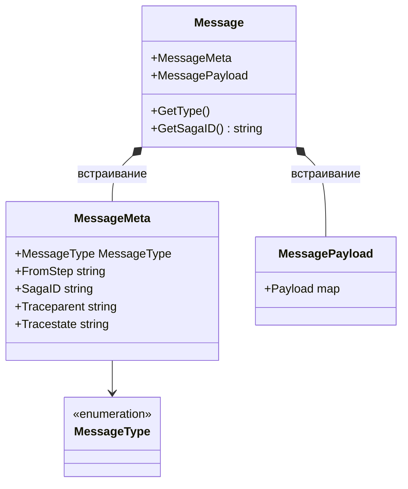
```mermaid
classDiagram
    direction TB

    class MessageType {
        <<enumeration>>
    }

    class MessageMeta {
        +MessageType MessageType
        +FromStep string
        +SagaID string
        +Traceparent string
        +Tracestate string
    }

    class MessagePayload {
        +Payload map
    }

    class Message {
        +MessageMeta
        +MessagePayload
        +GetType()
        +GetSagaID() string
    }


    Message *-- MessageMeta : встраивание
    Message *-- MessagePayload : встраивание
    MessageMeta --> MessageType
```
* "Executor"
Внутреннее выполнение шага делегируется сущности `Executor`. Именно `Executor` управляет запуском бизнес-логики шага в транзакции, записью результата в `Outbox`, применением retry-механизмов и переходом к компенсирующему сценарию при ошибке.

В совокупности перечисленные сущности формируют основной пользовательский API библиотеки. Они позволяют описывать распределенный процесс на уровне шагов, сообщений и обработчиков, не опускаясь до ручного управления транспортом, транзакциями и служебным состоянием.

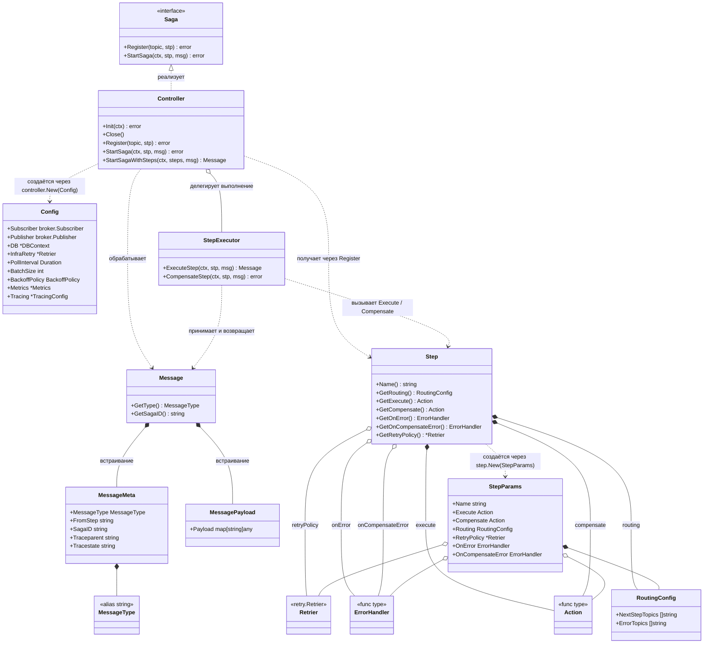
```mermaid
classDiagram
    direction TB

    class MessageType {
        <<alias string>>
    }

    class MessageMeta {
        +MessageType MessageType
        +FromStep string
        +SagaID string
        +Traceparent string
        +Tracestate string
    }

    class MessagePayload {
        +Payload map[string]any
    }

    class Message {
        +GetType() MessageType
        +GetSagaID() string
    }

    class RoutingConfig {
        +NextStepTopics []string
        +ErrorTopics []string
    }

    class Action {
        <<func type>>
    }

    class ErrorHandler {
        <<func type>>
    }

    class Retrier {
        <<retry.Retrier>>
    }

    class Step {
        +Name() string
        +GetRouting() RoutingConfig
        +GetExecute() Action
        +GetCompensate() Action
        +GetOnError() ErrorHandler
        +GetOnCompensateError() ErrorHandler
        +GetRetryPolicy() *Retrier
    }

    class StepParams {
        +Name string
        +Execute Action
        +Compensate Action
        +Routing RoutingConfig
        +RetryPolicy *Retrier
        +OnError ErrorHandler
        +OnCompensateError ErrorHandler
    }

    class Saga {
        <<interface>>
        +Register(topic, stp) error
        +StartSaga(ctx, stp, msg) error
    }

    class Controller {
        +Init(ctx) error
        +Close()
        +Register(topic, stp) error
        +StartSaga(ctx, stp, msg) error
        +StartSagaWithSteps(ctx, steps, msg) Message
    }

    class Config {
        +Subscriber broker.Subscriber
        +Publisher broker.Publisher
        +DB *DBContext
        +InfraRetry *Retrier
        +PollInterval Duration
        +BatchSize int
        +BackoffPolicy BackoffPolicy
        +Metrics *Metrics
        +Tracing *TracingConfig
    }

    class StepExecutor {
        +ExecuteStep(ctx, stp, msg) Message
        +CompensateStep(ctx, stp, msg) error
    }

    Message *-- MessageMeta : встраивание
    Message *-- MessagePayload : встраивание
    MessageMeta *-- MessageType

    Step *-- RoutingConfig : routing
    Step *-- Action : execute
    Step *-- Action : compensate
    Step o-- ErrorHandler : onError
    Step o-- ErrorHandler : onCompensateError
    Step o-- Retrier : retryPolicy

    StepParams *-- RoutingConfig
    StepParams o-- Action
    StepParams o-- ErrorHandler
    StepParams o-- Retrier
    Step ..> StepParams : создаётся через step.New(StepParams)

    Saga <|.. Controller : реализует
    Controller o-- StepExecutor : делегирует выполнение
    Controller ..> Step : получает через Register
    Controller ..> Message : обрабатывает
    Controller ..> Config : создаётся через controller.New(Config)

    StepExecutor ..> Step : вызывает Execute / Compensate
    StepExecutor ..> Message : принимает и возвращает
```

#### 2.2.4. Инфраструктурные абстракции и инверсия зависимостей
Одной из проблем, которую необходимо было решить при реализации, была независимость от конкретных СУБД и брокеров, чтобы библиотека не была привязана к конкретному стеку.

Для того чтобы библиотека могла встраиваться в разные приложения, её взаимодействие с внешней инфраструктурой строится не через конкретные реализации, а через набор узких интерфейсов. Это позволяет не привязываться к конкретному брокеру сообщений или базе данных.

Идею инверсии зависимостей в контексте библиотеки можно показать на упрощенной UML-диаграмме. Без инверсии верхнеуровневый компонент зависит от конкретных инфраструктурных реализаций напрямую. С инверсией зависимостей тот же компонент зависит только от абстракций, а конкретные адаптеры уже реализуют эти контракты.

Без инверсии зависимостей:

```mermaid
classDiagram
    class SagaRuntime
    class NATSClient
    class PostgresDB

    SagaRuntime --> NATSClient : 
    SagaRuntime --> PostgresDB : 
```

С инверсией зависимостей:

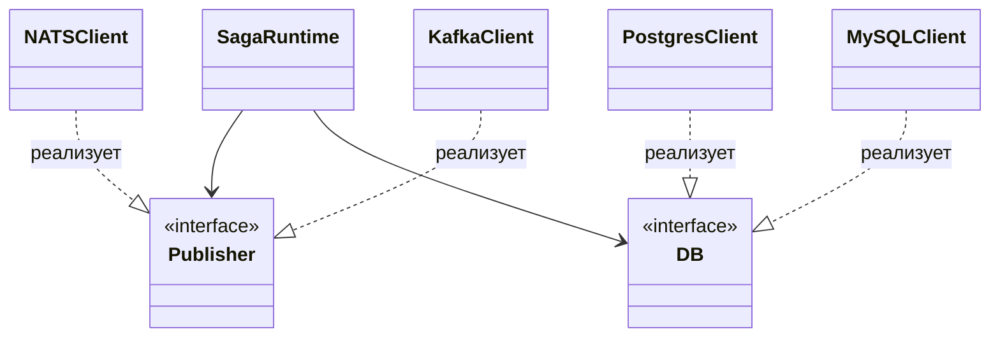
```mermaid
classDiagram
    class SagaRuntime

    class Publisher {
        <<interface>>
    }

    class DB {
        <<interface>>
    }

    class NATSClient
    class KafkaClient
    class PostgresClient
    class MySQLClient

    SagaRuntime --> Publisher : 
    SagaRuntime --> DB : 
    NATSClient ..|> Publisher : реализует
    PostgresClient ..|> DB : реализует
    KafkaClient..|> Publisher : реализует
    MySQLClient ..|> DB : реализует
```

Для независимости от брокера выделены интерфейсы "Publisher" и "Subsciber" и объединяющий их "Pubsub". Они задают минимальный контракт для публикации события в топик и подписки на входящий поток сообщений. Благодаря этому элемент "Saga" зависит только от контрактов, а не от конкретных реализаций.

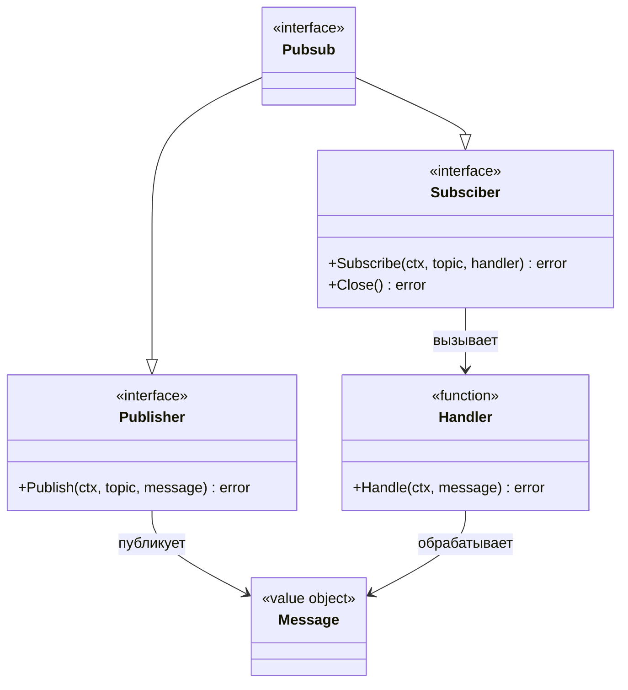
```mermaid
classDiagram
    direction TB

    class Publisher {
        <<interface>>
        +Publish(ctx, topic, message) error
    }

    class Subsciber {
        <<interface>>
        +Subscribe(ctx, topic, handler) error
        +Close() error
    }

    class Pubsub {
        <<interface>>
    }

    class Message {
        <<value object>>
    }

    class Handler {
        <<function>>
        +Handle(ctx, message) error
    }

    Pubsub --|> Publisher
    Pubsub --|> Subsciber
    Publisher --> Message : публикует
    Subsciber --> Handler : вызывает
    Handler --> Message : обрабатывает
```

Аналогичным образом организован слой доступа к данным. Для этого определены интерфейсы, которые описывают операции выполнения запросов, чтения строк и управления транзакцией. Эти абстракции позволяют внутренним компонентам библиотеки, работать с базой через единый контракт. Пользовательский обработчик шага также получает не конкретную транзакцию драйвера, а интерфейс, что позволяет выполнять бизнес-запросы внутри локальной транзакции без зависимости от конкретной библиотеки доступа к данным.

Библиотека хранит сведения о диалекте СУБД. За счёт этого учитываются различия в запросах между разными базами данных.

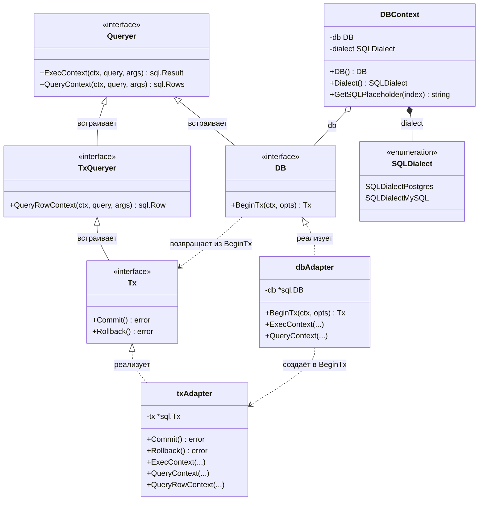
```mermaid
classDiagram
    direction TB

    class SQLDialect {
        <<enumeration>>
        SQLDialectPostgres
        SQLDialectMySQL
    }

    class Queryer {
        <<interface>>
        +ExecContext(ctx, query, args) sql.Result
        +QueryContext(ctx, query, args) sql.Rows
    }

    class TxQueryer {
        <<interface>>
        +QueryRowContext(ctx, query, args) sql.Row
    }

    class Tx {
        <<interface>>
        +Commit() error
        +Rollback() error
    }

    class DB {
        <<interface>>
        +BeginTx(ctx, opts) Tx
    }

    class DBContext {
        -db DB
        -dialect SQLDialect
        +DB() DB
        +Dialect() SQLDialect
        +GetSQLPlaceholder(index) string
    }

    class dbAdapter {
        -db *sql.DB
        +BeginTx(ctx, opts) Tx
        +ExecContext(...)
        +QueryContext(...)
    }

    class txAdapter {
        -tx *sql.Tx
        +Commit() error
        +Rollback() error
        +ExecContext(...)
        +QueryContext(...)
        +QueryRowContext(...)
    }

    Queryer <|-- TxQueryer : встраивает
    TxQueryer <|-- Tx : встраивает
    Queryer <|-- DB : встраивает
    DB ..> Tx : возвращает из BeginTx

    DB <|.. dbAdapter : реализует
    Tx <|.. txAdapter : реализует
    dbAdapter ..> txAdapter : создаёт в BeginTx

    DBContext o-- DB : db
    DBContext *-- SQLDialect : dialect
```

С архитектурной точки зрения это решение реализует принцип инверсии зависимостей: верхнеуровневые компоненты библиотеки не знают, какой именно брокер или драйвер БД используется в конкретном приложении. Благодаря этому пользователь может подключить готовую реализацию либо создать собственный адаптер, если библиотека не поддерживает нужный стек из "коробки". Тем самым достигаются расширяемость, переносимость и упрощение интеграции.

У выбранного подхода есть и ограничение. Хотя библиотека абстрагирует работу с хранилищем, она опирается на библиотеку Go `database/sql`, которая предназначена для работы с реляционными базами данных. Следовательно, текущая реализация ориентирована именно на реляционные СУБД и не претендует на универсальную поддержку произвольных типов хранилищ.  

#### 2.2.5. Транзакционность шага и управление транзакцией
Ещё одна проблема, которую необходимо было решить, — это абстрагирование пользователя от логики транзакций. Поскольку реализуется паттерн Saga, сущности в коде должны соответствовать сущностям предметной области: шаг саги, описанный в коде, обязан соответствовать логике паттерна. Атомарность локального шага — одно из его ключевых свойств. Без контроля транзакций на уровне библиотеки возникают следующие проблемы:

1. Пользователь может разбить бизнес-функцию на несколько транзакций внутри `Action`, что приведёт к неконсистентности при ошибке между транзакциями.

2. Шаг перестаёт реализовывать свойства из предметной области, так как перестаёт гарантировать поведение локальной транзакции из описания паттерна.

3. Без владения объектом транзакции библиотека не может реализовать паттерны Outbox и Inbox, необходимые для надёжной и идемпотентной обработки сообщений (подробнее — в следующих разделах).

Все это было решено выносом структруы транзакции из шага на уровень сущности "Executor". Как мы говорили выше, пользователь описывает действие в рамках сущности "Action", передавая в функцию не конкретный объект транзакции, а лишь его интерфейс, мы можем ограничить возможности разработчика, оставив в интерфейсе только самые необходимые методы, а методы подтверждения и отката транзакции убрать, инкапсулировав их во внутренней структуре библиотеки. Таким образом у пользователя просто не будет возможности управлять транзакцией внутри шага, а только возможность исполнять операции чтения и записи в базе данных, более широкий интерфейс с возможностью коммита и отката будет в ведение управляющей сущности "Executor".

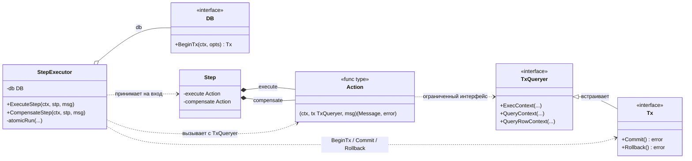
```mermaid
classDiagram
    direction LR

    class DB {
        <<interface>>
        +BeginTx(ctx, opts) Tx
    }

    class TxQueryer {
        <<interface>>
        +ExecContext(...)
        +QueryContext(...)
        +QueryRowContext(...)
    }

    class Tx {
        <<interface>>
        +Commit() error
        +Rollback() error
    }

    class Action {
        <<func type>>
        (ctx, tx TxQueryer, msg) (Message, error)
    }

    class Step {
        -execute Action
        -compensate Action
    }

    class StepExecutor {
        -db DB
        +ExecuteStep(ctx, stp, msg)
        +CompensateStep(ctx, stp, msg)
        -atomicRun(...)
    }

    TxQueryer <|-- Tx : встраивает

    Step *-- Action : execute
    Step *-- Action : compensate

    StepExecutor o-- DB : db
    StepExecutor ..> Tx : BeginTx / Commit / Rollback
    StepExecutor ..> Step : принимает на вход
    StepExecutor ..> Action : вызывает с TxQueryer

    Action ..> TxQueryer : ограниченный интерфейс
```

Таким образом, управление транзакцией остается на стороне библиотеки. Пользователю не нужно самому открывать транзакцию, не нужно следить за ее фиксацией или откатом и не нужно знать о записи о получении и отправке событий. 

#### 2.2.6. Маршрутизация и схема движения сообщений
Одной из важных частей реализации стала маршрутизация. Библиотека предоставляет удобный интерфейс для описания маршрутов шагов и связей между сервисами, тогда как саму передачу сообщений и обнаружение сервисов берёт на себя брокер сообщений.

Маршрутизация описывается через структуру `RoutingConfig` внутри `Step`, указывая два типа топиков: 
* `NextStepTopics` для успешного исхода 
* `ErrorTopics` для ошибочного

При ошибках все события отправляются в топики для ошибок.

Содержательное разделение на «прямой» и «компенсационный» путь полностью остается на стороне пользователя, а библиотека только исполняет маршрут.

* `EventTypeComplete` - сигнализирует об успешном завершении шага. Такое сообщение означает, что предыдущий участник саги выполнил свою часть работы и ожидает продолжения процесса. При получении этого типа запускается исполнение шага.
* `EventTypeFailed` - сигнализирует об ошибке или необходимости компенсации. При получении этого типа запускается компенсирующее действие шага.

Если шаг не удался, то отправляется сообщение в ErrorTopic с типом `EventTypeFailed`. Когда сервис выполнил свой компенсирующий шаг, он публикует сообщение с типом `EventTypeFailed` в свои `ErrorTopics`. Следующий сервис в цепочке получает его, видит тип `EventTypeFailed` и также запускает свою компенсацию. Таким образом, сигнал об откате распространяется по цепочке в обратном направлении — от сервиса к сервису — до тех пор, пока все задействованные участники не выполнят свои компенсирующие действия.

Такое устройство означает, что пользователь сам формирует топологию компенсационного пути через `ErrorTopics`: указывая нужные топики, он определяет, какой сервис следующим получит сигнал к откату. Библиотека внутри каждого сервиса при этом не знает о форме всей цепочки — она только обеспечивает публикацию события в заданные топики и обработку входящего события нужным типом действия.

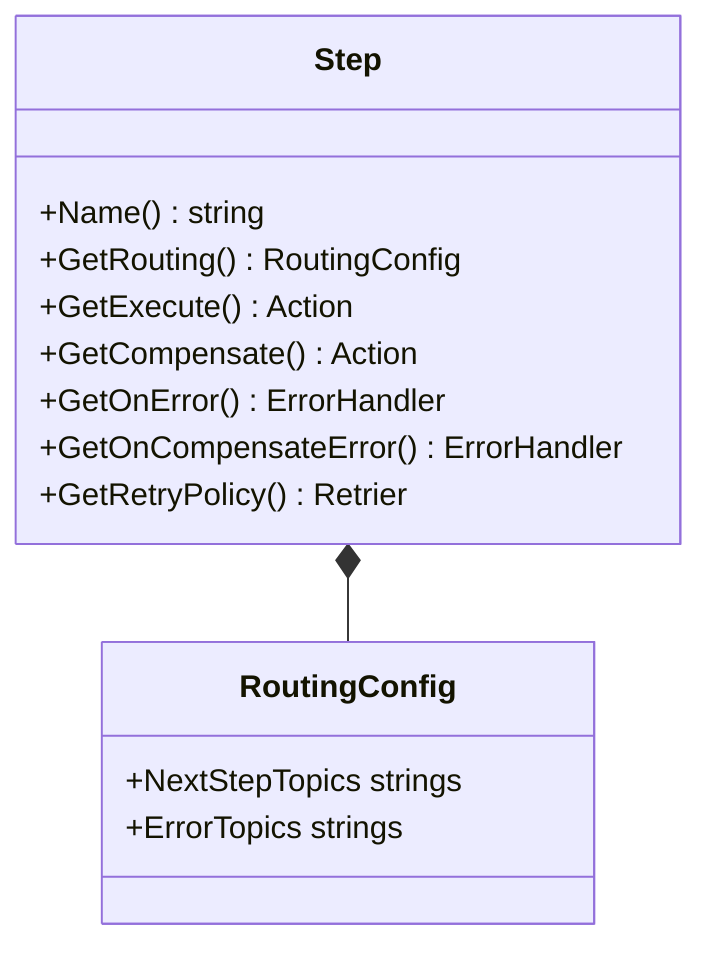
```mermaid
classDiagram
    direction TB

    class RoutingConfig {
        +NextStepTopics strings
        +ErrorTopics strings
    }

    class Step {
        +Name() string
        +GetRouting() RoutingConfig
        +GetExecute() Action
        +GetCompensate() Action
        +GetOnError() ErrorHandler
        +GetOnCompensateError() ErrorHandler
        +GetRetryPolicy() Retrier
    }


    Step *-- RoutingConfig
```

##### 2.2.6.1. Роль SagaID и контекста саги в сообщениях
В сообщениях важно передавать контекст саги. Его должен заполнить пользователь. Зачем это нужно:
Бибилиотека не хранит состояния внутри сервиса. Каждый сервис знает только о своем текущем шаге пока его исполняет. После того как сообщение отправлено в следующий топик, сервис "забывает" об этой операции - он не хранит, на каком шаге находится сага в целом и что произошло до него. Это означает, что между шагами нет разделяемой памяти или общего хранилища состояния процесса. Поэтому единственным носителем контекста распределенного процесса остается само сообщение: оно должно содержать всё необходимое для того, чтобы принимающий сервис мог выполнить свою работу или компенсировать ее без обращения к внешнему источнику состояния.

Сквозной идентификатор `SagaID` связывает все события одной саги в единую цепочку вне зависимости от того, сколько сервисов задействовано. Он позволяет каждому участнику понять, к какому процессу относится входящее событие, и при необходимости найти связанные данные в собственном хранилище для выполнения компенсации.

Помимо идентификатора, сообщение несет прикладной контекст — данные, необходимые следующему участнику для выполнения своей части транзакции. Именно через этот контекст сервисы координируются без центрального узла: каждый шаг получает ровно столько информации, сколько ему нужно для принятия решения. При компенсации этот же механизм работает в обратную сторону: сервис использует контекст из входящего сообщения, чтобы понять, что именно откатить.

#### 2.2.8. Обеспечение надежности и устойчивости

#### Обеспечение надежности обработки сообщений

Поскольку брокер сообщений используется как метод коммуникации, необходимо решить несколько проблем с надёжностью доставки.

##### Паттерн Outbox: гарантированная доставка

Представим, что шаг локальной транзакции выполнен успешно, но при попытке отправить сообщение в брокер произошёл сбой. Транзакция зафиксирована, однако другие сервисы об этом не знают.

Вместо того чтобы публиковать сообщение в брокер непосредственно в момент выполнения шага, библиотека сохраняет его в таблицу `Outbox` в рамках той же локальной транзакции, в которой выполняется бизнес-логика. Это означает, что если транзакция зафиксировалась, сообщение гарантированно попало в базу данных и будет доставлено. Если транзакция откатилась, сообщения в `Outbox` не будет — и брокер ничего не получит.

Сущность "Writer" отвечает за создание записи в БД. За фактическую доставку записанных сообщений в брокер отвечает сущность "Reader". Он периодически опрашивает таблицу "Outbox", выбирает незакрытые записи и батчами публикует каждое сообщение в брокер. При успешной публикации, сообщение помечается в базе данных как отправленное. При ошибке обновляется счетчик попыток и время следующей попытки вычисляется по настроенной политике перерыва между отправкой, то есть промежуток между повторами постепенно увеличивается.

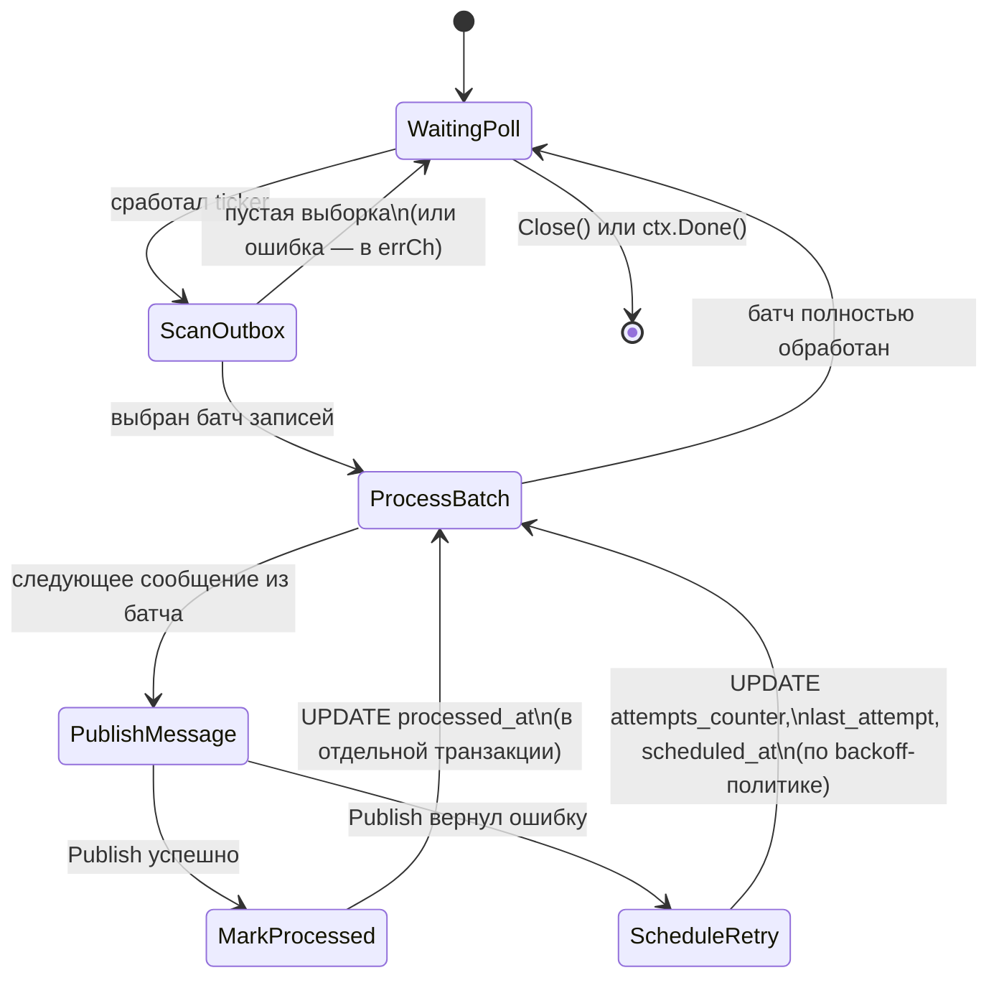
```mermaid
stateDiagram-v2
    [*] --> WaitingPoll

    WaitingPoll --> ScanOutbox: сработал ticker
    WaitingPoll --> [*]: Close() или ctx.Done()

    ScanOutbox --> WaitingPoll: пустая выборка\n(или ошибка — в errCh)
    ScanOutbox --> ProcessBatch: выбран батч записей

    ProcessBatch --> PublishMessage: следующее сообщение из батча
    ProcessBatch --> WaitingPoll: батч полностью обработан

    PublishMessage --> MarkProcessed: Publish успешно
    PublishMessage --> ScheduleRetry: Publish вернул ошибку

    MarkProcessed --> ProcessBatch: UPDATE processed_at\n(в отдельной транзакции)
    ScheduleRetry --> ProcessBatch: UPDATE attempts_counter,\nlast_attempt, scheduled_at\n(по backoff-политике)
```

##### Паттерн Inbox: слой идемпотентности
Поскольку библиотека поддерживает разные брокеры, для надёжной доставки могут использоваться брокеры с политикой `at-least-once`, что означает возможность повторной доставки одного и того же сообщения.

Представим, что один из сервисов публикует событие о бронировании авиабилета и передаёт его сервису бронирования отелей. Допустим, тот получил событие и забронировал отель, однако не отправил подтверждение — например, если сервис вышел из строя перед отправкой ACK или брокер временно стал недоступен. При повторной доставке сообщения бизнес-логика выполнится дважды, что нарушит консистентность, если операция не идемпотентна.

Для решения этой проблемы используется паттерн `Inbox`. При получении входящего сообщения, перед вызовом пользовательского `Action`, библиотека записывает обрабатываемое сообщение в таблицу базы данных в той же транзакции (как и в случае с outbox). Эта операция пытается вставить запись по ключу `(saga_id, from_step)`, который в свою очередь является и ключом идемпотентности. Если такая запись уже существует, то библиотека считает шаг уже обработанным и возвращает управление вызывающей стороне.

Можно было делегировать решение проблемы идемпотентности пользователю на уровне бизнес-логики, однако не все сервисы могут обеспечить идемпотентность транзакций, такую логику не всегда легко реализовать, и в готовых системах она может отсутствовать. Поэтому было принято решение ввести искусственный слой идемпотентности в виде таблицы `Inbox`.

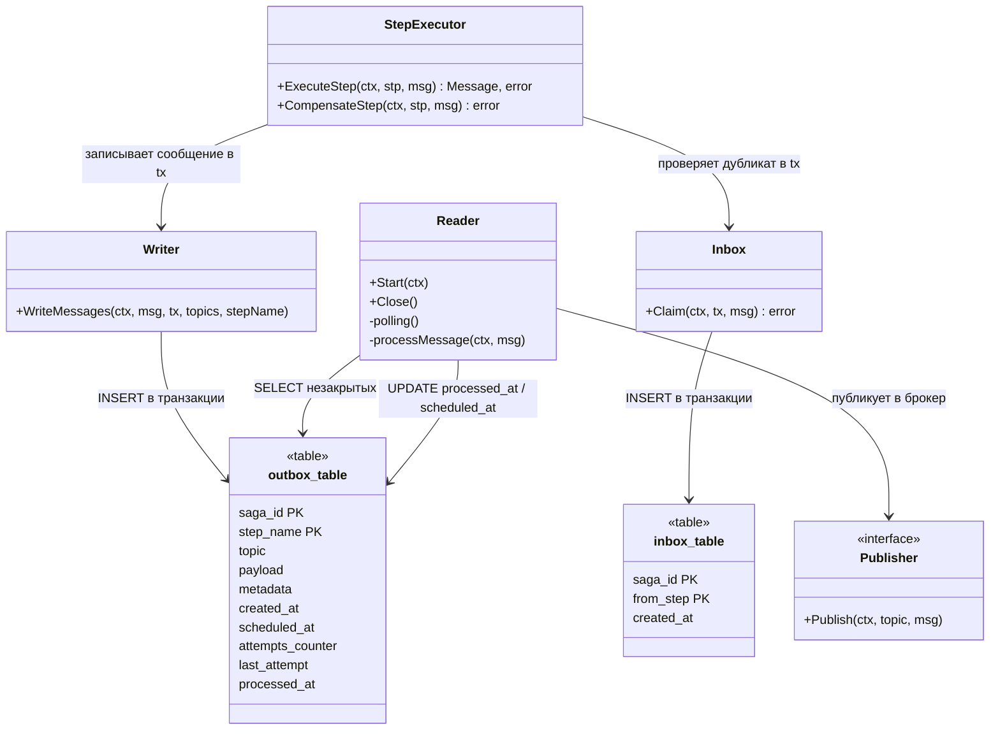
```mermaid
classDiagram
    direction TB

    class StepExecutor {
        +ExecuteStep(ctx, stp, msg) Message, error
        +CompensateStep(ctx, stp, msg) error
    }

    class Writer {
        +WriteMessages(ctx, msg, tx, topics, stepName)
    }

    class Reader {
        +Start(ctx)
        +Close()
        -polling()
        -processMessage(ctx, msg)
    }

    class Inbox {
        +Claim(ctx, tx, msg) error
    }

    class outbox_table {
        <<table>>
        saga_id PK
        step_name PK
        topic
        payload
        metadata
        created_at
        scheduled_at
        attempts_counter
        last_attempt
        processed_at
    }

    class inbox_table {
        <<table>>
        saga_id PK
        from_step PK
        created_at
    }

    class Publisher {
        <<interface>>
        +Publish(ctx, topic, msg)
    }

    StepExecutor --> Writer : записывает сообщение в tx
    StepExecutor --> Inbox : проверяет дубликат в tx
    Writer --> outbox_table : INSERT в транзакции
    Inbox --> inbox_table : INSERT в транзакции
    Reader --> outbox_table : SELECT незакрытых
    Reader --> Publisher : публикует в брокер
    Reader --> outbox_table : UPDATE processed_at / scheduled_at
```

##### Создание необходимых таблиц в БД

Для вышеописанных паттернов создаются две служебные таблицы в базе данных сервиса. Таблицы создаются автоматически при вызове `Init` через встроенный механизм миграций без использования внешних инструментов с учетом используемой СУБД.

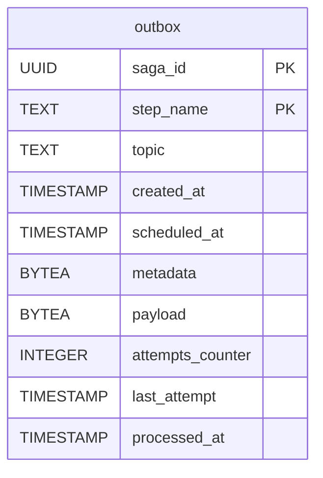
```mermaid
erDiagram
    outbox {
        UUID saga_id PK
        TEXT step_name PK
        TEXT topic
        TIMESTAMP created_at
        TIMESTAMP scheduled_at
        BYTEA metadata
        BYTEA payload
        INTEGER attempts_counter
        TIMESTAMP last_attempt
        TIMESTAMP processed_at
    }
```

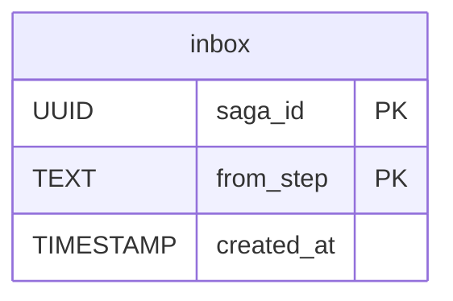
```mermaid
erDiagram
    inbox {
        UUID saga_id PK
        TEXT from_step PK
        TIMESTAMP created_at
    }
```

##### Повторные попытки

Микросервисная архитектура подвержена временным сбоям: база данных может быть кратковременно недоступна, брокер может не принять сообщение, внешний сервис может не ответить. Без механизма повторных попыток любой из этих сбоев привёл бы к потере шага или к немедленной компенсации по причине, которая носит временный характер и могла бы разрешиться сама по себе.

Для решения этой проблемы предусмотрено два независимых механизма повторных попыток, поскольку инфраструктурные сбои и ошибки внутри логики пользователя имеют разную природу и требуют разных стратегий обработки.

Первый механизм работает на уровне операций самой библиотеки — открытии транзакции, записи в `Outbox` и коммите — и настраивается глобально. Если одна из этих операций завершается временной ошибкой, библиотека автоматически повторяет всю атомарную операцию с новой транзакцией. Пользовательские ошибки, возникшие внутри `Action`, этим механизмом не повторяются: они отделяются от инфраструктурных сбоев и передаются на уровень выше. Второй механизм настраивается отдельно для каждого шага и отвечает именно за повторы пользовательского `Action`. Повтор происходит только в том случае, если пользователь явно пометил ошибку как временную — например, при кратковременной недоступности внешнего сервиса; в остальных случаях ошибка немедленно передаётся в обработчик ошибок или запускает компенсацию. Первый механизм библиотека применяет автоматически, второй предоставляет пользователю как опциональный инструмент.

Для управления интервалами между попытками предусмотрена настраиваемая политика задержки. Поддерживаются стратегии с линейно растущим и экспоненциальным интервалом, а также вариант с добавлением случайного разброса для снижения нагрузки при одновременном восстановлении нескольких компонентов системы. Та же политика применяется при повторных попытках публикации сообщений из `Outbox` в брокер.

Взаимодействие компонентов retry-системы показано на диаграмме ниже.

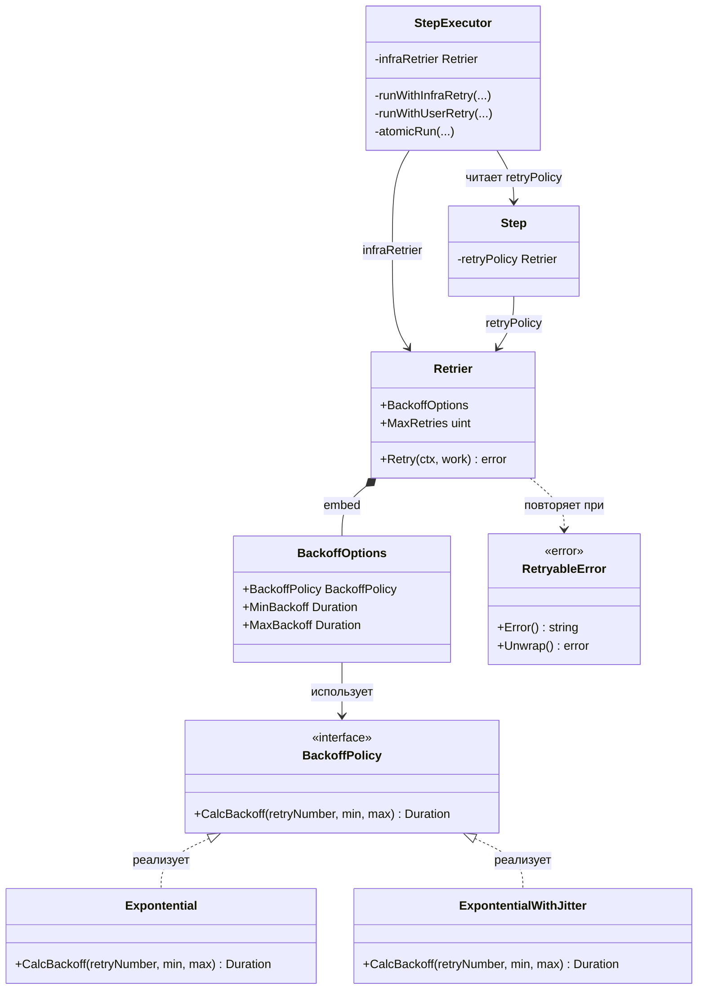
```mermaid
classDiagram
    direction TB

    class BackoffPolicy {
        <<interface>>
        +CalcBackoff(retryNumber, min, max) Duration
    }

    class Expontential {
        +CalcBackoff(retryNumber, min, max) Duration
    }

    class ExpontentialWithJitter {
        +CalcBackoff(retryNumber, min, max) Duration
    }

    class BackoffOptions {
        +BackoffPolicy BackoffPolicy
        +MinBackoff Duration
        +MaxBackoff Duration
    }

    class Retrier {
        +BackoffOptions
        +MaxRetries uint
        +Retry(ctx, work) error
    }

    class RetryableError {
        <<error>>
        +Error() string
        +Unwrap() error
    }

    class StepExecutor {
        -infraRetrier Retrier
        -runWithInfraRetry(...)
        -runWithUserRetry(...)
        -atomicRun(...)
    }

    class Step {
        -retryPolicy Retrier
    }

    BackoffPolicy <|.. Expontential : реализует
    BackoffPolicy <|.. ExpontentialWithJitter : реализует
    Retrier *-- BackoffOptions : embed
    BackoffOptions --> BackoffPolicy : использует
    StepExecutor --> Retrier : infraRetrier
    Step --> Retrier : retryPolicy
    StepExecutor --> Step : читает retryPolicy
    Retrier ..> RetryableError : повторяет при
```

#### 2.2.9. Наблюдаемость и средства контроля выполнения

Как было указано в разделе с анализом предметной области, система с асинхронной обработкой саги в целом может не бояться некоторых отказов, так как даже если сервисы откажут, то сообщения будут доставлены им после восстановления, однако существует ряд сбоев, которые приводят к неконсистентному состоянию баз данных и тогда мы можем попасть в ситуацию, когда начатая сага никогда не совершиться из-за того, что транзакции будут падать с ошибками. Хореографическая сага не имеет центрального координатора, который знал бы о состоянии всего процесса. Это означает, что при отказе одного из сервисов без дополнительных инструментов невозможно быстро понять, на каком шаге остановилась сага, была ли запущена компенсация и в каком сервисе возникла ошибка. Для восстановления вручную необходимо дать разработчику набор метрик и логов, а также трассировку шагов, чтобы можно было понять, как восстановить консистентность.

Для решения этой проблемы библиотека предоставляет встроенную поддержку двух стандартных средств наблюдаемости: метрик и распределённой трассировки. Оба средства опциональны и подключаются через конфигурацию.

Метрики собираются через `Prometheus`. Библиотека фиксирует три показателя: счётчик запущенных саг, счётчик выполненных шагов с разбивкой по имени шага, типу операции (`execute` или `compensate`) и статусу (`success` или `failure`), а также гистограмму времени выполнения каждого шага. Эти данные позволяют отслеживать частоту ошибок на конкретных шагах, аномальное время выполнения и динамику запуска новых саг.

Распределённая трассировка в библиотеке построена на принципе разделения контракта и реализации. В качестве контракта выбран стандарт `OpenTelemetry` — библиотека опирается только на его API для работы со спэнами и не содержит собственного бэкенда сбора трейсов. Это позволяет подключать произвольный инструмент наблюдаемости без изменений в коде: конкретный провайдер, способ экспорта и место хранения трейсов определяются пользовательским приложением.

Логика трейсинга, создаваемая библиотекой, минимальна и соответствует структуре саги. При включённой трассировке на старте саги открывается корневой спэн, а на каждый выполненный или компенсируемый шаг — отдельный дочерний спэн. Каждый спэн описывается идентификатором саги, именем шага и видом операции (выполнение либо компенсация); при ошибке спэн помечается как неуспешный, а текст ошибки сохраняется в его атрибутах. Этого набора достаточно, чтобы в системе сбора трейсов восстановить полный путь конкретного экземпляра саги по всем участвующим сервисам.

Для сквозной трассировки между сервисами используется стандарт `W3C Trace Context`: идентификаторы трассировки переносятся в метаданных сообщения и автоматически извлекаются на принимающей стороне. За счёт этого трассировка работает поверх произвольного брокера и не требует от сервисов общей платформы наблюдаемости — достаточно поддержки одного и того же стандарта распространения контекста.

Оба средства намеренно опциональны: если пользователь не передаёт `Metrics` или `TracingConfig` в конфигурацию, библиотека работает без них. Такое решение сохраняет легковесность и не навязывает конкретный стек наблюдаемости тем сервисам, где он не нужен.

(добавить скрин с jaeger)

#### 2.2.7. Executor

Центральным элементом выполнения шага является внутренняя структура `StepExecutor`. С точки зрения пользователя эта структура скрыта — он взаимодействует только с интерфейсом `Saga` и описывает шаги через `step.Step`. Вся оркестрация внутри шага делегируется `StepExecutor`.

`StepExecutor` контролирует следующие аспекты выполнения саги:

 * При выполнении любого шага - как прямого, так и компенсирующего он самостоятельно открывает и закрывает транзакцию базы данных. 

 * Управление записью в outbox и inbox

 * Обработка ошибок и повторных попыток

 * Вызов пользовательских обработчиков ошибок

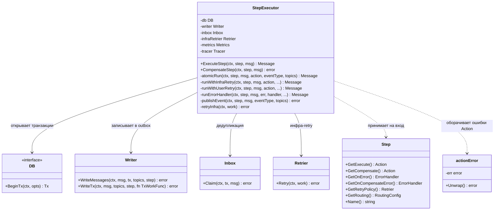
```mermaid
classDiagram
    class StepExecutor {
        -db DB
        -writer Writer
        -inbox Inbox
        -infraRetrier Retrier
        -metrics Metrics
        -tracer Tracer
        +ExecuteStep(ctx, step, msg) Message
        +CompensateStep(ctx, step, msg) error
        -atomicRun(ctx, step, msg, action, eventType, topics) Message
        -runWithInfraRetry(ctx, step, msg, action, ...) Message
        -runWithUserRetry(ctx, step, msg, action, ...) Message
        -runErrorHandler(ctx, step, msg, err, handler, ...) Message
        -publishEvent(ctx, step, msg, eventType, topics) error
        -retryInfra(ctx, work) error
    }

    class DB {
        <<interface>>
        +BeginTx(ctx, opts) Tx
    }

    class Writer {
        +WriteMessages(ctx, msg, tx, topics, step) error
        +WriteTx(ctx, msg, topics, step, fn TxWorkFunc) error
    }

    class Inbox {
        +Claim(ctx, tx, msg) error
    }

    class Retrier {
        +Retry(ctx, work) error
    }

    class Step {
        +GetExecute() Action
        +GetCompensate() Action
        +GetOnError() ErrorHandler
        +GetOnCompensateError() ErrorHandler
        +GetRetryPolicy() Retrier
        +GetRouting() RoutingConfig
        +Name() string
    }

    class actionError {
        -err error
        +Unwrap() error
    }

    StepExecutor --> DB : открывает транзакции
    StepExecutor --> Writer : записывает в outbox
    StepExecutor --> Inbox : дедупликация
    StepExecutor --> Retrier : инфра-retry
    StepExecutor ..> Step : принимает на вход
    StepExecutor ..> actionError : оборачивает ошибки Action
```

#### 2.2.13. Диаграммы последовательности выполнения `Saga`

Для наглядного представления динамики взаимодействия компонентов библиотеки, прикладного кода, брокера сообщений и базы данных приведены три диаграммы последовательности, охватывающие ключевые сценарии работы саги.

##### Успешный сценарий выполнения шага

На диаграмме показан путь сообщения от получения из брокера до атомарной фиксации результата в базе данных и публикации события для следующего шага. Ключевая особенность — атомарность действий пользовательского `Action` и записи в `outbox` в рамках единой транзакции.

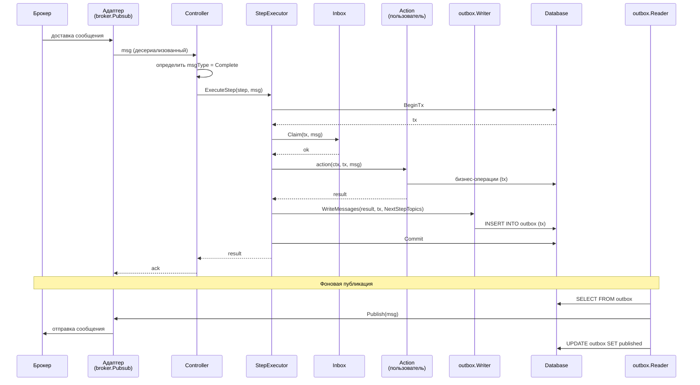
```mermaid
sequenceDiagram
    participant Broker as Брокер
    participant Adapter as Адаптер<br/>(broker.Pubsub)
    participant Ctrl as Controller
    participant Exec as StepExecutor
    participant Inbox as Inbox
    participant Action as Action<br/>(пользователь)
    participant Writer as outbox.Writer
    participant DB as Database
    participant Reader as outbox.Reader

    Broker->>Adapter: доставка сообщения
    Adapter->>Ctrl: msg (десериализованный)
    Ctrl->>Ctrl: определить msgType = Complete
    Ctrl->>Exec: ExecuteStep(step, msg)
    Exec->>DB: BeginTx
    DB-->>Exec: tx
    Exec->>Inbox: Claim(tx, msg)
    Inbox-->>Exec: ok
    Exec->>Action: action(ctx, tx, msg)
    Action->>DB: бизнес-операции (tx)
    Action-->>Exec: result
    Exec->>Writer: WriteMessages(result, tx, NextStepTopics)
    Writer->>DB: INSERT INTO outbox (tx)
    Exec->>DB: Commit
    Exec-->>Ctrl: result
    Ctrl-->>Adapter: ack

    Note over Reader,Broker: Фоновая публикация
    Reader->>DB: SELECT FROM outbox
    Reader->>Adapter: Publish(msg)
    Adapter->>Broker: отправка сообщения
    Reader->>DB: UPDATE outbox SET published
```

##### Сценарий с ошибкой и запуском компенсации

Диаграмма иллюстрирует поведение системы при неудачном выполнении `Action`: исчерпание политики повторных попыток, попытку отработать `OnError` и, в случае её неудачи, публикацию события `EventTypeFailed` в `ErrorTopics`, что приводит к запуску компенсации на предыдущих сервисах.

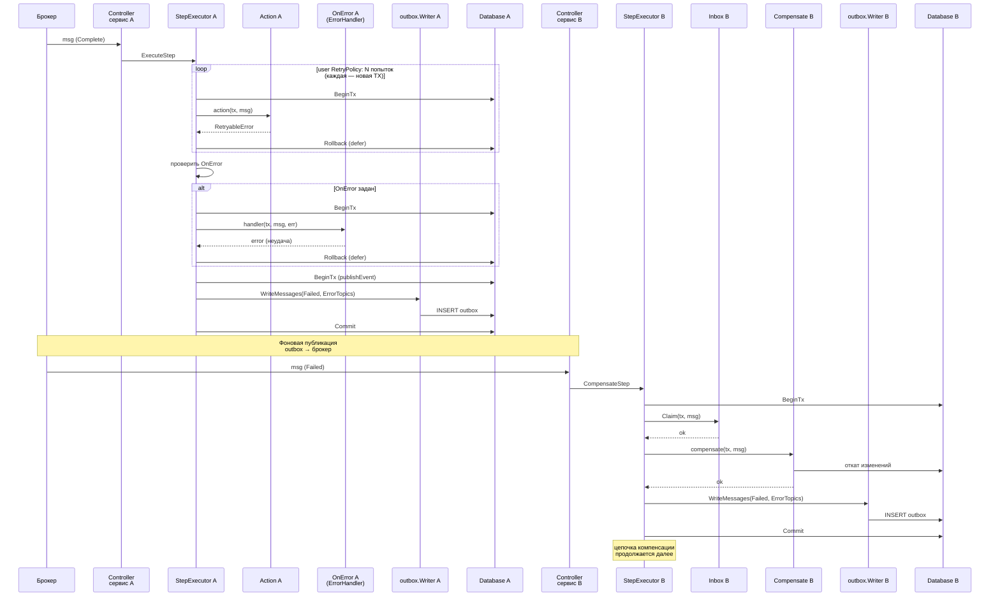
```mermaid
sequenceDiagram
    participant Broker as Брокер
    participant CtrlA as Controller<br/>сервис A
    participant ExecA as StepExecutor A
    participant ActionA as Action A
    participant OnErrA as OnError A<br/>(ErrorHandler)
    participant WriterA as outbox.Writer A
    participant DB as Database A
    participant CtrlB as Controller<br/>сервис B
    participant ExecB as StepExecutor B
    participant InboxB as Inbox B
    participant CompB as Compensate B
    participant WriterB as outbox.Writer B
    participant DBb as Database B

    Broker->>CtrlA: msg (Complete)
    CtrlA->>ExecA: ExecuteStep

    loop user RetryPolicy: N попыток<br/>(каждая — новая TX)
        ExecA->>DB: BeginTx
        ExecA->>ActionA: action(tx, msg)
        ActionA-->>ExecA: RetryableError
        ExecA->>DB: Rollback (defer)
    end

    ExecA->>ExecA: проверить OnError

    alt OnError задан
        ExecA->>DB: BeginTx
        ExecA->>OnErrA: handler(tx, msg, err)
        OnErrA-->>ExecA: error (неудача)
        ExecA->>DB: Rollback (defer)
    end

    ExecA->>DB: BeginTx (publishEvent)
    ExecA->>WriterA: WriteMessages(Failed, ErrorTopics)
    WriterA->>DB: INSERT outbox
    ExecA->>DB: Commit

    Note over Broker,CtrlB: Фоновая публикация<br/>outbox → брокер
    Broker->>CtrlB: msg (Failed)
    CtrlB->>ExecB: CompensateStep
    ExecB->>DBb: BeginTx
    ExecB->>InboxB: Claim(tx, msg)
    InboxB-->>ExecB: ok
    ExecB->>CompB: compensate(tx, msg)
    CompB->>DBb: откат изменений
    CompB-->>ExecB: ok
    ExecB->>WriterB: WriteMessages(Failed, ErrorTopics)
    WriterB->>DBb: INSERT outbox
    ExecB->>DBb: Commit
    Note over ExecB: цепочка компенсации<br/>продолжается далее
```

##### Повторная доставка и идемпотентная обработка через `Inbox`

Диаграмма демонстрирует поведение системы при повторной доставке одного и того же сообщения брокером (гарантия «at-least-once»): первое сообщение выполняется штатно, повторное блокируется `Inbox`-паттерном без повторного выполнения пользовательской бизнес-логики.

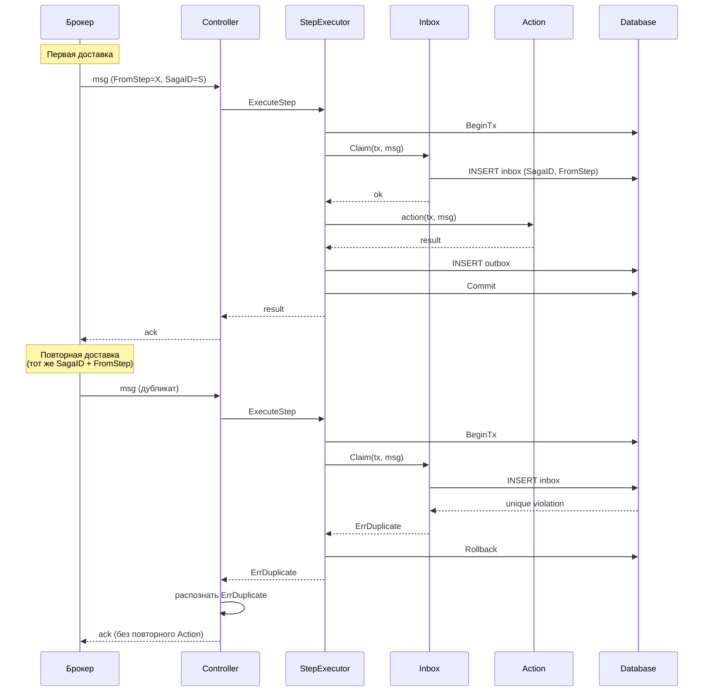
```mermaid
sequenceDiagram
    participant Broker as Брокер
    participant Ctrl as Controller
    participant Exec as StepExecutor
    participant Inbox as Inbox
    participant Action as Action
    participant DB as Database

    Note over Broker: Первая доставка

    Broker->>Ctrl: msg (FromStep=X, SagaID=S)
    Ctrl->>Exec: ExecuteStep
    Exec->>DB: BeginTx
    Exec->>Inbox: Claim(tx, msg)
    Inbox->>DB: INSERT inbox (SagaID, FromStep)
    Inbox-->>Exec: ok
    Exec->>Action: action(tx, msg)
    Action-->>Exec: result
    Exec->>DB: INSERT outbox
    Exec->>DB: Commit
    Exec-->>Ctrl: result
    Ctrl-->>Broker: ack

    Note over Broker: Повторная доставка<br/>(тот же SagaID + FromStep)

    Broker->>Ctrl: msg (дубликат)
    Ctrl->>Exec: ExecuteStep
    Exec->>DB: BeginTx
    Exec->>Inbox: Claim(tx, msg)
    Inbox->>DB: INSERT inbox
    DB-->>Inbox: unique violation
    Inbox-->>Exec: ErrDuplicate
    Exec->>DB: Rollback
    Exec-->>Ctrl: ErrDuplicate
    Ctrl->>Ctrl: распознать ErrDuplicate
    Ctrl-->>Broker: ack (без повторного Action)
```

### 2.3. Итоговый функционал и использование