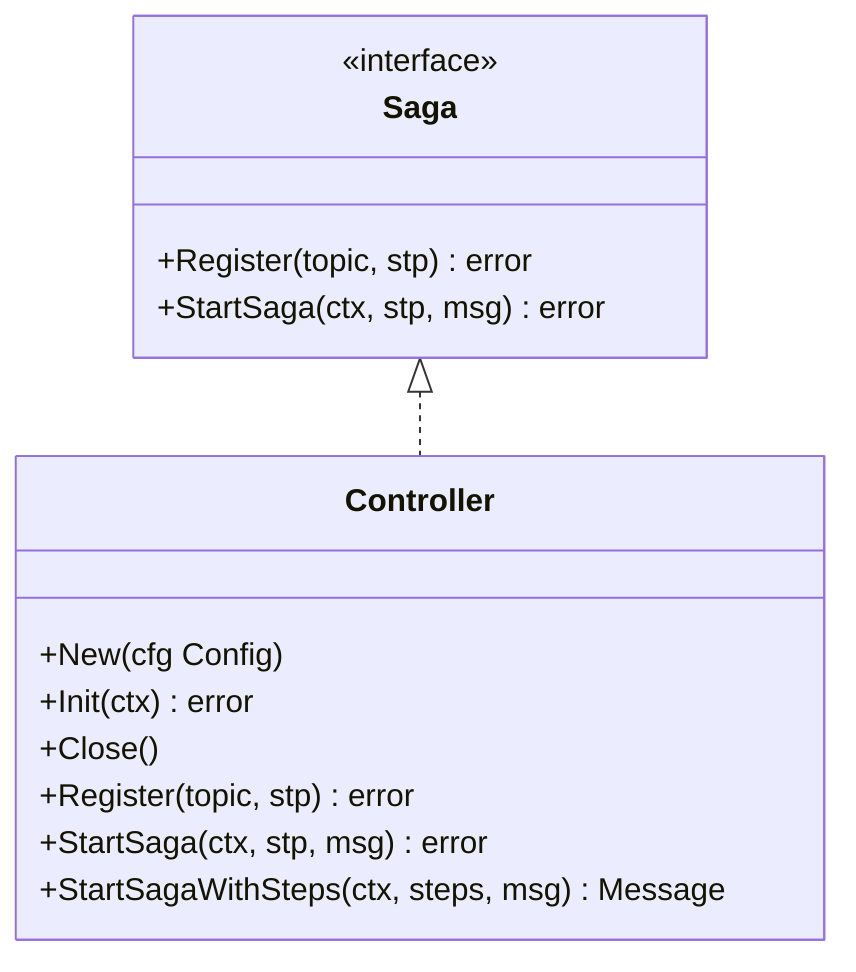
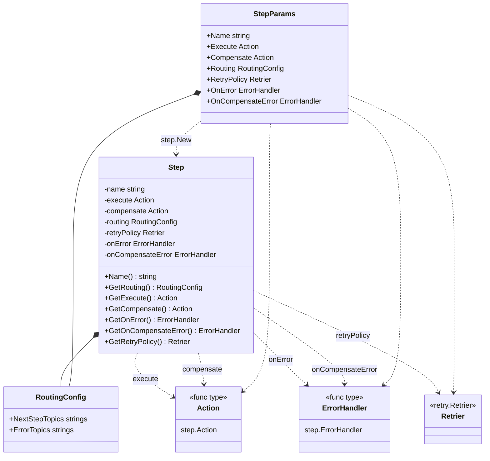
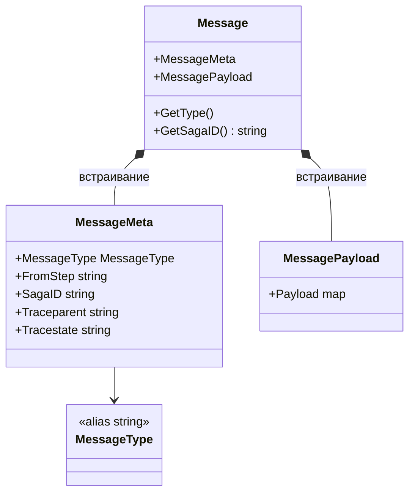
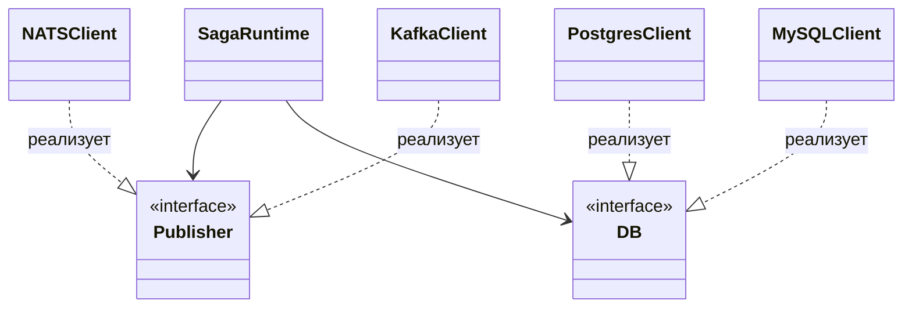
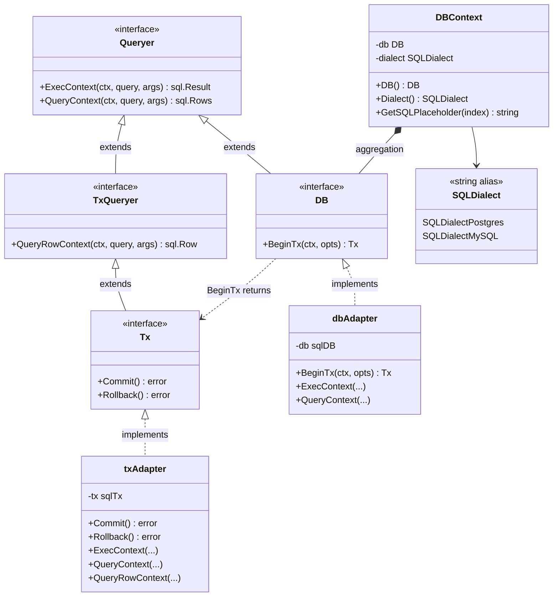
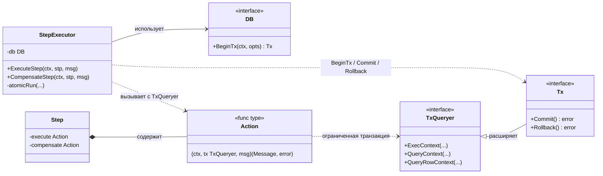
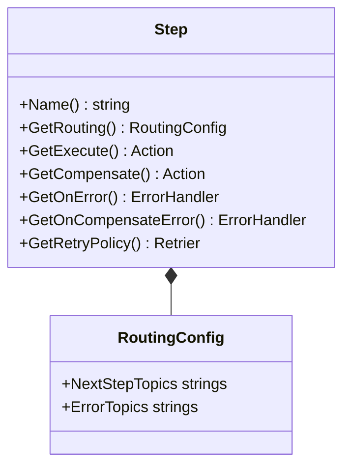
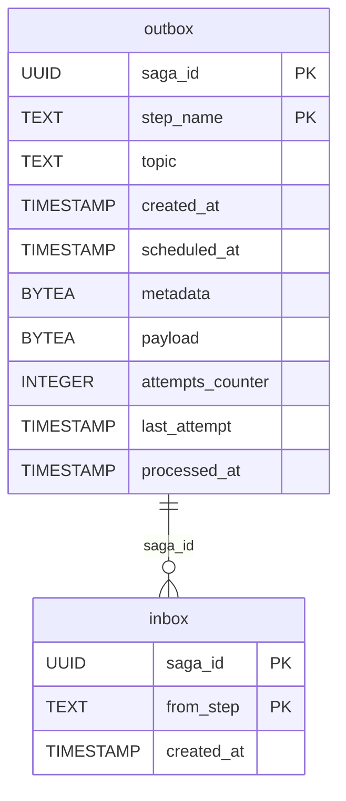

### 2.2. Архитектура библиотеки

#### 2.2.1. Высокоуровневое описание архитектуры
Сформированные требования диктуют и архитектуру системы. Самым главным решением является то, что библиотека создана для реализации именно хореографических саг.

Выбор хореографии объяснен следующией причине. Как было описано ранее одним из функциональных требований является легкость внедрения, хореографическая сага позволяет использовать уже существующию систему, без внедрения в нее дополнитльного узла координатора и не навязывать отдельную платформу исполнения, что соответствует требованию легковесности. 

Однако это накладывает и определенные ограничения. Библиотека будет полезной только для систем, которые уже используют событийно-ориентированное взаимодействие или могут быть естественным образом к нему адаптированы, то есть те системы в которых уже есть настроенный брокер сообщений. В ином случае придется разворачивать этот узел, так как от брокера зависит координация сообщений и их асинхронная доставка. Кроме того, вместе с преимуществами хореографии библиотека наследует и ее характерные сложности, которые были описаны в анализе предметной области: 
 1. отсутствие единой точки управления
 2. необходимость идемпотентной обработки
 3. зависимость от надежности обмена сообщениями и более сложное восстановление после частичных отказов. 
 
 Тем не менее именно такой компромисс позволяет реализовать распределенную транзакцию как легковесную библиотеку.

#### 2.2.2. Инверсия управления

В основе архитектуры библиотеки лежит принцип инверсии управления. По такому принципу часто строят различные фреймворки, например Django, Spring, его идея в том, что пользователь не управляет вручную всем жизненным циклом выполнения распределенного шага, а передает библиотеке контроль над инфраструктурной частью процесса. В случае текущего продука, этот принцип раскрывается так: разработчик описывает бизнес-логику шага, компенсационное действие, структуру сообщений и прикладную реакцию на ошибки, тогда как библиотека берет на себя координацию выполнения, связанную с приемом входящего сообщения, обеспечением идемпотентности, запуском шага в транзакции.


// подумать включать ли это
Такое распределение ответственности позволяет четко отделить прикладной уровень от инфраструктурного. Пользователь работает с сущностями предметной области, не дублируя в каждом сервисе одинаковую логику по управлению транзакцией, маршрутизации сообщений, повторной доставке и фиксации служебного состояния. Библиотека, в свою очередь, реализует единый жизненный цикл выполнения шага и тем самым стандартизирует обработку распределенного процесса во всех сервисах, в которые она интегрируется.

// подумать включать ли это
Однако такой подход связан и с архитектурным компромиссом. С одной стороны, разработчик получает более простой, единообразный и расширяемый способ работы с сагой. С другой стороны, он должен следовать жизненному циклу выполнения, задаваемому библиотекой, и учитывать ограничения, связанные с ее внутренней моделью обработки шагов. Иными словами, гибкость на уровне низкоуровневой инфраструктурной логики частично ограничивается ради достижения единообразия, повторного использования и снижения сложности интеграции.

#### 2.2.3. Построение API
Пользовательский интерфейс библиотеки строится вокруг ограниченного набора абстракций, через которые описывается выполнение распределенного процесса. Они формируют API библиотеки. Ключевыми сущностями являются.
  * "Saga" (сага)
  * "Step" (шаг)
  * "Action" (действие)
  * "Message" (сообщение)
  * "Executor" (исполнитель)

* "Saga" в коде представлена одноименным интерфейсом верхнего уровня. Эта абстракция задает минимальный API управления выполнением саги: 
    * Метод "Register" - регистрация шага на входящем топике
    * Метод "StartSaga" - запуск новой саги, если сервис начинает сагу. 

В библиотеке этот интерфейс имплементируется через "Controller". Эта сущность выступает внешней точкой входа в библиотеку, через который пользователь конфигурирует библиотеку и передает ей управление обработкой сообщений.



* Одной из центральных абстракций является "Step": 
Представляет собой структуру, в которой пользователь описывает бизнес логику шага распределенной транзакции. Таким образом строя сагу. Шаг можно зарегистрировать на определенном входящем топике используя вышеупомянутый интерфейс "Saga", а также указать топики, в которые будут отправлены сообщения при ошибке (топики компенсации) или при удачном исходе шага, то есть топики для следующих шагов. Описывая марщрутизацию шага можно строить гибкие пути между сервисами.

Структура шага и связанные с ней абстракции показаны на UML-диаграмме ниже.



* Сущность "Action" (действие) представляет собой тип функций, которыми оперерирует шаг. Бизнес действие описывается пользователем в соотвествии с сигнатурой, которую задает "Action", именно в функции Action пользователь должен описать действия которые будут выполнены в рамках локальной транзакции или в рамках компенсации. То есть для "Step" "Action" является единицей действия. Эта сущность диктует пользователю дизайн бизнес шага. Получив сообщение от другого сервиса и проведя десериализацию "Step" вызовет действие передав все параметры. 

Язык Go предоставляет возможность создать пользовательский тип на основе встроенного типа, в этом случае - функции. Чтобы создать "Action" пользователь должен имплементировать функцию с такой сигнатурой и поместить ее внутри шага.
    type Action func(ctx context.Context, tx database.TxQueryer, msg message.Message) (message.Message, error)

В результате выполнения функция возвращает новое сообщение, структуру сообщения формирует пользователь в итоге благодаря этой абстракции библиотека предоставляет довольно интуитивное поведение, человек получает сообщение, выполняет шаг, возвращает сообщение следующему шагу через обычный "return".

* Структура "Message" служит единицей межсервисного обмена и переносит контекст выполнения между участниками процесса. Для наглядности ее состав приведен в таблице.

| Часть структуры | Поле | Назначение |
| --- | --- | --- |
| `MessageMeta` | `MessageType` | Тип сообщения, определяющий характер события: успешное выполнение шага или переход к компенсации. |
| `MessageMeta` | `FromStep` | Имя шага-источника, из которого было отправлено сообщение. |
| `MessageMeta` | `SagaID` | Сквозной идентификатор распределенного процесса, связывающий сообщения в рамках одной `Saga`. |
| `MessageMeta` | `Traceparent` | Служебное поле трассировки в формате `W3C Trace Context`. |
| `MessageMeta` | `Tracestate` | Дополнительное поле трассировки для передачи контекста наблюдаемости. |
| `MessagePayload` | `Payload` | Полезная нагрузка сообщения с прикладными данными. |

Так как служебная информация всегда имеет одинаковую структуру, за ее декодирование отвечает библиотека, однако заполнение и десериализация полезной нагрузки остается в зоне отвественности пользователя. По сети Message передается в формате JSON.


* "Executor"
Внутреннее выполнение шага делегируется сущности `Executor`. Именно `Executor` управляет запуском бизнес-логики шага в транзакции, записью результата в `Outbox`, применением retry-механизмов и переходом к компенсирующему сценарию при ошибке.

В совокупности перечисленные сущности формируют основной пользовательский API библиотеки. Они позволяют описывать распределенный процесс на уровне шагов, сообщений и обработчиков, не опускаясь до ручного управления транспортом, транзакциями и служебным состоянием.

// вместо этого вставить UML


#### 2.2.4. Инфраструктурные абстракции и инверсия зависимостей
Одной из проблем, которую необходимо было решить при реализации продукта была независимость от конкретных СУБД и брокеров, чтобы библиотека не была заточена под конкретный стэк.

Для того чтобы библиотека могла встраиваться в разные приложения, ее взаимодействие с внешней инфраструктурой строится не через конкретные реализации, а через набор узких интерфейсов. Это позволяет не приявазываться к конкретному брокеру сообщений или базе данных.

Идею инверсии зависимостей в контексте библиотеки можно показать на упрощенной UML-диаграмме. Без инверсии верхнеуровневый компонент зависит от конкретных инфраструктурных реализаций напрямую. С инверсией зависимостей тот же компонент зависит только от абстракций, а конкретные адаптеры уже реализуют эти контракты.

Без инверсии зависимостей:

```mermaid
classDiagram
    class SagaRuntime
    class NATSClient
    class PostgresDB

    SagaRuntime --> NATSClient : 
    SagaRuntime --> PostgresDB : 
```

С инверсией зависимостей:



Для независимости от брокера выделены интерфейсы "Publisher" и "Subsciber" и объединяющий их "Pubsub". Они задают минимальный контракт для публикации события в топик и подписки на входящий поток сообщений. Благодаря этому элемент "Saga" зависит только от контрактов, а не от конкретных реализаций.

Аналогичным образом организован слой доступа к данным. Для этого определены интерфейсы, которые описывают операции выполнения запросов, чтения строк и управления транзакцией. Эти абстракции позволяют внутренним компонентам библиотеки, работать с базой через единый контракт. Пользовательский обработчик шага также получает не конкретную транзакцию драйвера, а интерфейс, что позволяет выполнять бизнес-запросы внутри локальной транзакции без зависимости от конкретной библиотеки доступа к данным.

Библиотека хранит сведения о диалекте СУБД. За счет этого учитывается различия в запросах между разными базами данных.

// это можно не включать
Состав интерфейсов и их связи показаны на UML-диаграмме ниже. Базовый интерфейс `Queryer` описывает операции выполнения запросов без возврата строки, его расширяет `TxQueryer` за счет `QueryRowContext`, а `Tx` дополнительно вводит `Commit` и `Rollback` для управления жизненным циклом транзакции. Интерфейс `DB` представляет соединение с базой и умеет открывать транзакцию через `BeginTx`. Конкретные адаптеры `dbAdapter` и `txAdapter` оборачивают стандартные `sql.DB` и `sql.Tx` и реализуют соответствующие интерфейсы. Структура `DBContext` агрегирует `DB` и значение `SQLDialect`, тем самым связывая соединение с диалектом и позволяя библиотеке формировать корректные плейсхолдеры и миграции для разных СУБД.



// это можно не включать
Такое разделение интерфейсов отражает уровни ответственности: `Queryer` описывает общие операции запросов, `TxQueryer` добавляет доступ к одной строке и используется пользовательским обработчиком шага, `Tx` управляет фиксацией транзакции внутри библиотеки, а `DB` служит точкой открытия новой транзакции. Пользовательский `Action` зависит только от `TxQueryer` и не имеет доступа к `Commit` или `Rollback`, что исключает случайное нарушение транзакционного контура со стороны прикладной логики.

С архитектурной точки зрения это решение реализует принцип инверсии зависимостей: верхнеуровневые компоненты библиотеки не знают, какой именно брокер или драйвер БД используется в конкретном приложении. Благодаря этому пользователь может подключить готовую реализацию либо создать собственный адаптер, если библиотека не поддерживает нужный стек из "коробки". Тем самым достигаются расширяемость, переносимость и упрощение интеграции.

У выбранного подхода есть и ограничение. Хотя библиотека абстрагирует работу с хранилищем, она опирается на модель Go библиотеку `database/sql`, которая может работать не со всеми базами. Следовательно, текущая реализация ориентирована именно на реляционные базы данных и не претендует на универсальную поддержку произвольных типов хранилищ.  

#### 2.2.5. Транзакционность шага и управление транзакцией
Еще одну проблему которую было необходиом решить - это абстрагирование пользователя от логики транзакций. Зачем это нужно. Так как мы реализуем паттерн Saga, нужно чтобы наши сущности в коде совпадали с сущностями предметной области, то есть чтобы шаг саги, который мы описываем в коде соотвествовал логике в описании паттерна. Атомарность локального шага - это одно из важных свойств саги. Что может произойти если не контролировать это на уровне библиотеки.
1. Пользователь может разбить бизнес функцию на несколько транзакций внутри Action, что приведет к неконсистентности при ошибке между транзакциями и мы никак не сможем на это повлиять
2. Как было сказано выше, метод Step перестает реализовывать свойства из его предметной области, так как перестает гарантировать поведение локальной транзакции из описания паттерна.
3. Без контролирования транзакций на уровне библиотеки мы не можем реализовать некоторые нефункциональные требования, например надежность, так как с применением паттерна Outbox и Inbox мы хотим добиться безопасной и демпотентной обработки сообщения, путем использования слоя идемпотентности над базой данных (о надежности будет рассказано в следующих разделах), мы не сможем этого сделать без владения объектом транзакции, которая необходима при реализации этих паттернов.

Все это было решено выносом структруы транзакции из шага на уровень сущности "Executor". Как мы говорили выше, пользователь описывает действие в рамках сущности "Action", передавая в функцию не конкретный объект транзакции, а лишь его интерфейс, мы можем ограничить возможности разработчика, оставив в интерфейсе только самые необходимые методы, а методы подтверждения и отката транзакции убрать, инкапсулировав их во внутренней структуре библиотеки. Таким образом у пользователя просто не будет возможности управлять транзакцией внутри шага, а только возможность исполнять операции чтения и записи в базе данных, более широкий интерфейс с возможностью коммита и отката будет в ведение управляющей сущности "Executor".

Распределение ролей при работе с транзакцией показано на UML-диаграмме ниже. `StepExecutor` зависит от "широкого" интерфейса `DB` и владеет полным интерфейсом транзакции `Tx`, поэтому только он может выполнить `BeginTx`, `Commit` и `Rollback`. Пользовательская функция `Action` работает с суженным интерфейсом `TxQueryer`, в котором доступны только операции запросов, но не управление жизненным циклом транзакции. Сам объект `Tx`, создаваемый библиотекой, реализует `TxQueryer` через наследование интерфейсов, поэтому один и тот же физический объект транзакции передается в `Action` в ограниченной форме, а в `Executor` используется в полной.



Таким образом, управление транзакцией остается на стороне библиотеки. Пользователю не нужно самому открывать транзакцию, не нужно следить за ее фиксацией или откатом и не нужно знать о записи о получении и отправке событий. 

#### 2.2.6. Маршрутизация и схема движения сообщений
Одной из важных частей реализации стало - реализация маршрутизация. Как и ппрежде необходимо дать удобный интерфейс для описания роутинга шагов и связей между сервисами, саму передачу сообщений а также решения задач обнаружения сервисов возьмет на себя брокер сообщений.


Маршрутизация описывается через структуру `RoutingConfig` внутри `Step`, указывая два типа топиков: 
* `NextStepTopics` для успешного исхода 
* `ErrorTopics` для ошибочного

При ошибках все отвеправляется в топики для ошибок.

Содержательное разделение на «прямой» и «компенсационный» путь полностью остается на стороне пользователя, а библиотека только исполняет маршрут.

* `EventTypeComplete` - сигнализирует об успешном завершении шага. Такое сообщение означает, что предыдущий участник саги выполнил свою часть работы и ожидает продолжения процесса. При получении этого типа запускается исполнение шага.
* `EventTypeFailed` - сигнализирует об ошибке или необходимости компенсации. При получении этого типа запускается компенсирующее действие шага.

Если шаг не удался, то отправляется сообщение в ErrorTopic с типом `EventTypeFailed`. Когда сервис выполнил свой компенсирующий шаг, он публикует сообщение с типом `EventTypeFailed` в свои `ErrorTopics`. Следующий сервис в цепочке получает его, видит тип `EventTypeFailed` и также запускает свою компенсацию. Таким образом, сигнал об откате распространяется по цепочке в обратном направлении — от сервиса к сервису — до тех пор, пока все задействованные участники не выполнят свои компенсирующие действия.

Такое устройство означает, что пользователь сам формирует топологию компенсационного пути через `ErrorTopics`: указывая нужные топики, он определяет, какой сервис следующим получит сигнал к откату. Библиотека внутри каждого сервиса при этом не знает о форме всей цепочки — она только обеспечивает публикацию события в заданные топики и обработку входящего события нужным типом действия.



##### 2.2.6.1. Роль SagaID и контекста саги в сообщениях
В сообщениях важно передавать контекст саги. Его должен заполнить пользователь. Зачем это нужно:
Бибилиотека не хранит состояния внутри сервиса. Каждый сервис знает только о своем текущем шаге пока его исполняет. После того как сообщение отправлено в следующий топик, сервис "забывает" об этой операции - он не хранит, на каком шаге находится сага в целом и что произошло до него. Это означает, что между шагами нет разделяемой памяти или общего хранилища состояния процесса. Поэтому единственным носителем контекста распределенного процесса остается само сообщение: оно должно содержать всё необходимое для того, чтобы принимающий сервис мог выполнить свою работу или компенсировать ее без обращения к внешнему источнику состояния.

Сквозной идентификатор `SagaID` связывает все события одной саги в единую цепочку вне зависимости от того, сколько сервисов задействовано. Он позволяет каждому участнику понять, к какому процессу относится входящее событие, и при необходимости найти связанные данные в собственном хранилище для выполнения компенсации.

Помимо идентификатора, сообщение несет прикладной контекст — данные, необходимые следующему участнику для выполнения своей части транзакции. Именно через этот контекст сервисы координируются без центрального узла: каждый шаг получает ровно столько информации, сколько ему нужно для принятия решения. При компенсации этот же механизм работает в обратную сторону: сервис использует контекст из входящего сообщения, чтобы понять, что именно откатить.

#### 2.2.8. Обеспечение надежности и устойчивости

#### Обеспечение надежности обработки сообщений

Так как мы используем брокер сообщений как метод коммуникации, мы должны решить несколько проблем с надежностью доставки сообщений.

##### Паттерн Outbox: гарантированная доставка

Представим, что мы сделали шаг локальной транзакции, теперь нам надо отправить сообщение в брокер сообщений, однако если после мы зафиксируем транзакцию, но не сможем отправить сообщение в брокер, то мы фактически выполнили шаг, однако другие сервисы об этом не знают.

Вместо того чтобы публиковать сообщение в брокер непосредственно в момент выполнения шага, библиотека сохраняет его в таблицу `Outbox` в рамках той же локальной транзакции, в которой выполняется бизнес-логика. Это означает, что если транзакция зафиксировалась, сообщение гарантированно попало в базу данных и будет доставлено. Если транзакция откатилась, сообщения в `Outbox` не будет — и брокер ничего не получит.

Сущность "Writer" отвечает за создание записи в БД. За фактическую доставку записанных сообщений в брокер отвечает сущность "Reader". Он периодически опрашивает таблицу "Outbox", выбирает незакрытые записи и батчами публикует каждое сообщение в брокер. При успешной публикации, сообщение помечается в базе данных как отправленное. При ошибке обновляется счетчик попыток и время следующей попытки вычисляется по настроенной политике перерыва между отправкой, то есть промежуток между повторами постепенно увеличивается.


##### Паттерн Inbox: слой идемпотентности
Так как мы даем пользователю возможность использовать разные брокеры сообщений, для надежной доставки он может использовать брокеры с подтверждением доставки, они реализуют политику доставки At-least-once, а значит можем получить одно и то же сообщение несколько раз.

Представим, что один из сервисов во время транзакции публикует событие с созданием брони на авиабилет и передает информацию следующему сервису - сервису бронирования отелей. Допустим он получил событие и забронировал отель, однако не отправил подтверждение о том, что сообщение обработано, например, если сервис вышел из строея сразу перед тем как сервис отправил ACK или брокер перестал быть доступным и не получил подтверждение, тогда при получении сообщения второй раз мы обработаем его дважды и нарушим консистентность, если операция была неидемпотентна.

Для решения этой проблемы используется паттерн `Inbox`. При получении входящего сообщения, перед вызовом пользовательского `Action`, библиотека записывает обрабатываемое сообщение в таблицу базы данных в той же транзакции (как и в случае с outbox). Эта операция пытается вставить запись по ключу `(saga_id, from_step)`, который в свою очередь является и ключом идемпотентности. Если такая запись уже существует, то библиотека считает шаг уже обработанным и возвращает управление вызывающей стороне.

Можно было делегировать пользователю решение проблем идемпотентности на уровне бизнес логики, однако не все сервисы могут позволить себе идемпотентные транзакции, которые могли бы повторяться сколько угодно раз, такую логику не всегда легко реализовать и в готовых системах её вполне может не быть, поэтому было принято решение ввести искуственный слой идемпотентности в виде таблицы Inbox.

##### Создание необходимых таблиц в БД

Для вышеописанных паттерно создаются две служебные таблицы в базе данных сервиса. Таблицы создаются автоматически при вызове `Init` через встроенный механизм миграций без использования внешних инструментов с учетом используемой СУБД.

Структура таблиц и связи между ними показаны на ERD-диаграмме ниже.



Связь между таблицами не является жесткой реляционной зависимостью на уровне внешних ключей. Запись в `inbox` создается при получении входящего события: её `saga_id` совпадает с `saga_id` сообщений в `outbox`, отправленных в рамках той же саги. Таким образом, по `saga_id` можно восстановить полную историю шагов саги: какие сообщения были отправлены и какие входящие события были обработаны.


##### Повторные попытки

Библиотека использует два уровня повторных попыток, которые работают независимо и решают разные задачи.

Первый уровень — инфраструктурный retry (`infraRetrier`). Он настраивается глобально через `Config` и применяется к операциям самой библиотеки: открытию транзакции `BeginTx`, записи в `Outbox` и фиксации транзакции `Commit`. Если любая из этих операций завершается временной ошибкой, она оборачивается в `RetryableError` и `infraRetrier` повторяет всю атомарную операцию целиком с новой транзакцией. Это позволяет пережить кратковременные сбои базы данных без потери шага. Если `infraRetrier` не задан, инфраструктурные операции выполняются ровно один раз.

Второй уровень — пользовательский retry (`RetryPolicy`). Он задается отдельно для каждого `Step` и отвечает за повтор пользовательского `Action` при бизнес-ошибках, которые допускают повтор. Пользовательский retry является внешним циклом: каждая его попытка проходит через инфраструктурный retry и `atomicRun` с новой транзакцией. Таким образом, каждая попытка бизнес-логики — это полноценная атомарная операция.

Важно, что повтор `Action` происходит только при явно оборачиваемых ошибках. Если `Action` возвращает обычную ошибку, пользовательский retry останавливается и ошибка передается дальше. Если ошибка обернута через `retry.AsRetryable`, retry-цикл делает следующую попытку. Это дает пользователю явный контроль: транзиентные ошибки — например, недоступность внешнего сервиса — помечаются как повторяемые, а бизнес-ошибки сразу уходят в `ErrorHandler` или компенсацию.

Для управления интервалами между попытками библиотека предоставляет настраиваемую политику бэкоффа через интерфейс `BackoffPolicy`. В поставке реализованы два варианта: `Exponential`, при котором интервал линейно растет от номера попытки, и `ExponentialWithJitter`, добавляющий случайный разброс к интервалу для снижения нагрузки при одновременном восстановлении нескольких сервисов. Оба варианта принимают минимальный и максимальный бэкофф, а максимум работает как плато: интервал не превысит заданную границу. Та же политика бэкоффа используется в `Outbox Reader` для планирования повторных попыток публикации в брокер.

##### Разделение инфраструктурных и пользовательских ошибок

Для того чтобы механизм retry работал корректно, библиотека разделяет два класса ошибок. Инфраструктурные ошибки — сбои при открытии транзакции, записи в `Outbox` или коммите — оборачиваются в `retry.RetryableError`. Это сигнализирует `infraRetrier` о том, что операцию можно повторить целиком. Пользовательские ошибки из `Action` таким образом не оборачиваются и не повторяются инфраструктурным ретраером: они передаются в `ErrorHandler` или запускают компенсацию.

Аналогично работает пользовательский retry на уровне шага. Если `Action` хочет, чтобы его вызов был повторен при временной ошибке — например, при недоступности внешнего API, — ошибку нужно явно обернуть через `retry.AsRetryable`. Необернутые ошибки из `Action` повторяться не будут и сразу передадутся в обработчик ошибок. Таким образом, пользователь сам решает, какие ошибки допускают повтор, а библиотека обеспечивает соответствующее поведение.

#### 2.2.7. Механизм выполнения шага `Saga`
- Выполнение шага начинается с приема входящего сообщения и его проверки.
- Перед запуском бизнес-логики библиотека проверяет сообщение через `Inbox`, чтобы исключить повторную обработку одного и того же шага.
- После этого выполняется локальная бизнес-операция пользователя.
- При успешном завершении формируется исходящее сообщение, которое сохраняется в `Outbox` в рамках той же локальной транзакции.
- Публикация сообщения в брокер осуществляется отдельным фоновым механизмом чтения `Outbox`.
- В этом пункте необходимо описать входные точки библиотеки и полный процесс выполнения шага внутри одного сервиса.
- Проблема, которую решает: гарантированное и воспроизводимое выполнение отдельного шага распределенного процесса без смешения бизнес-логики с инфраструктурной обработкой сообщений.
- Связь с требованиями из `proektirovanie.md`: возможность описания шага саги, автоматическая обработка успешного завершения шага и ошибки, возможность интеграции с брокерами сообщений, наличие встроенных алгоритмов надежности.

#### 2.2.9. Наблюдаемость и средства контроля выполнения
- Библиотека предусматривает встроенные средства логирования, трассировки и сбора метрик `Prometheus`.
- Наблюдаемость должна позволять установить, на каком шаге находится `Saga`, где произошел сбой, была ли запущена компенсация и в какой момент времени возникло отклонение.
- Эти данные необходимы не только для оперативной диагностики, но и для последующего ручного анализа и восстановления консистентности.
- Проблема, которую решает: обеспечение прозрачности состояния `Saga` и возможности анализа причин отказа при восстановлении после сбоя.
- Связь с требованиями из `proektirovanie.md`: наблюдаемость и прозрачность процесса, надежность и отказоустойчивость.

#### 2.2.11. Полный путь взаимодействия пользователя с библиотекой
- В этом подпункте следует описать последовательность действий пользователя: подключение библиотеки, определение шагов, настройка маршрутизации, подключение адаптеров, запуск обработки и эксплуатация.
- Следует показать полный путь от точки входа в библиотеку до выполнения распределенного процесса.
- Подпункт нужен для демонстрации того, что библиотека представляет собой целостный сценарий интеграции, а не набор разрозненных компонентов.
- Проблема, которую решает: снижение сложности освоения библиотеки и демонстрация воспроизводимого сценария ее использования в прикладном сервисе.
- Связь с требованиями из `proektirovanie.md`: простота интеграции, возможность описания шага саги, возможность интеграции с брокерами сообщений, наличие пользовательской логики обработки ошибок.

#### 2.2.12. Use case-диаграмма и входные точки библиотеки
- Диаграмма вариантов использования должна показать, какие действия выполняет пользователь библиотеки и какие точки входа предоставляет система.
- На диаграмме следует отразить определение шага, настройку маршрутов, запуск обработки, обработку ошибок и наблюдение за состоянием процесса.
- Диаграмма нужна как внешнее представление границ библиотеки и ее взаимодействия с разработчиком и инфраструктурой.
- Проблема, которую решает: формализация сценариев использования библиотеки и уточнение границ ответственности между пользователем, библиотекой и внешними системами.
- Связь с требованиями из `proektirovanie.md`: простота интеграции, наблюдаемость, расширяемость.

#### 2.2.13. Диаграммы последовательности выполнения `Saga`
- В разделе необходимо привести диаграммы последовательности для успешного сценария выполнения.
- Отдельно следует показать сценарий с ошибкой и запуском компенсации.
- Дополнительно следует отразить публикацию сообщения через `Outbox`, а также сценарий повторной доставки и идемпотентной обработки.
- Эти диаграммы должны фиксировать динамику взаимодействия между сервисом, библиотекой, брокером сообщений и хранилищем состояния.
- Проблема, которую решает: наглядное представление временной динамики распределенного процесса и различий между нормальным и компенсационным сценарием выполнения.
- Связь с требованиями из `proektirovanie.md`: автоматическая обработка успешного завершения шага и ошибки, поддержка компенсирующего действия, надежность и отказоустойчивость, наблюдаемость.


#### 2.2.10. Хранение состояния и структура таблиц
- Библиотека остается `stateless` на уровне собственного управляющего процесса и переносит критически важное состояние в инфраструктурные таблицы базы данных.
- Для этого создаются таблицы `outbox` и `inbox`, используемые для надежной публикации сообщений и дедупликации входящих событий.
- В разделе следует описать подход к созданию таблиц для разных SQL-СУБД и ограничения, связанные с поддерживаемыми диалектами.
- Необходимо отдельно показать структуру таблиц `outbox` и `inbox`, а также пояснить роль их полей в обеспечении надежности.
- В этом пункте уместно привести `ERD`-диаграмму.
- Проблема, которую решает: хранение инфраструктурного состояния, необходимого для надежной доставки сообщений, дедупликации и восстановления после частичных отказов.
- Связь с требованиями из `proektirovanie.md`: надежность и отказоустойчивость, расширяемость, корректность и атомарность бизнес-шага.
