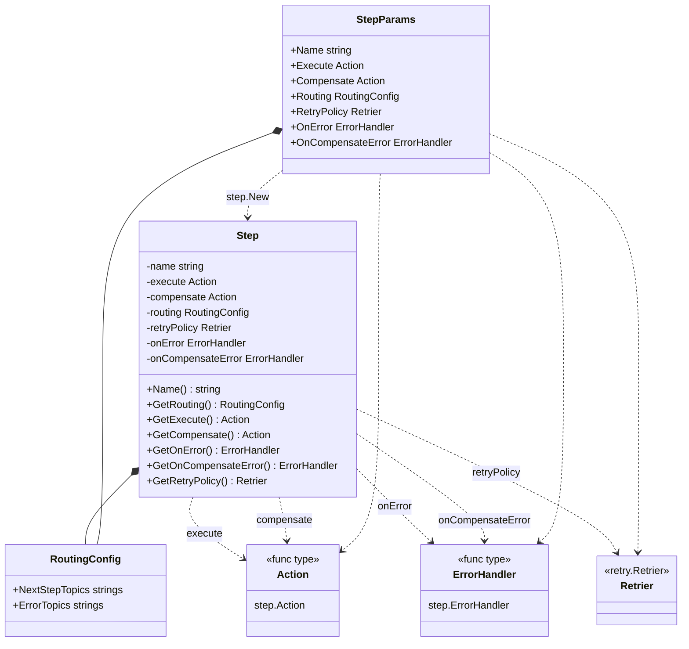
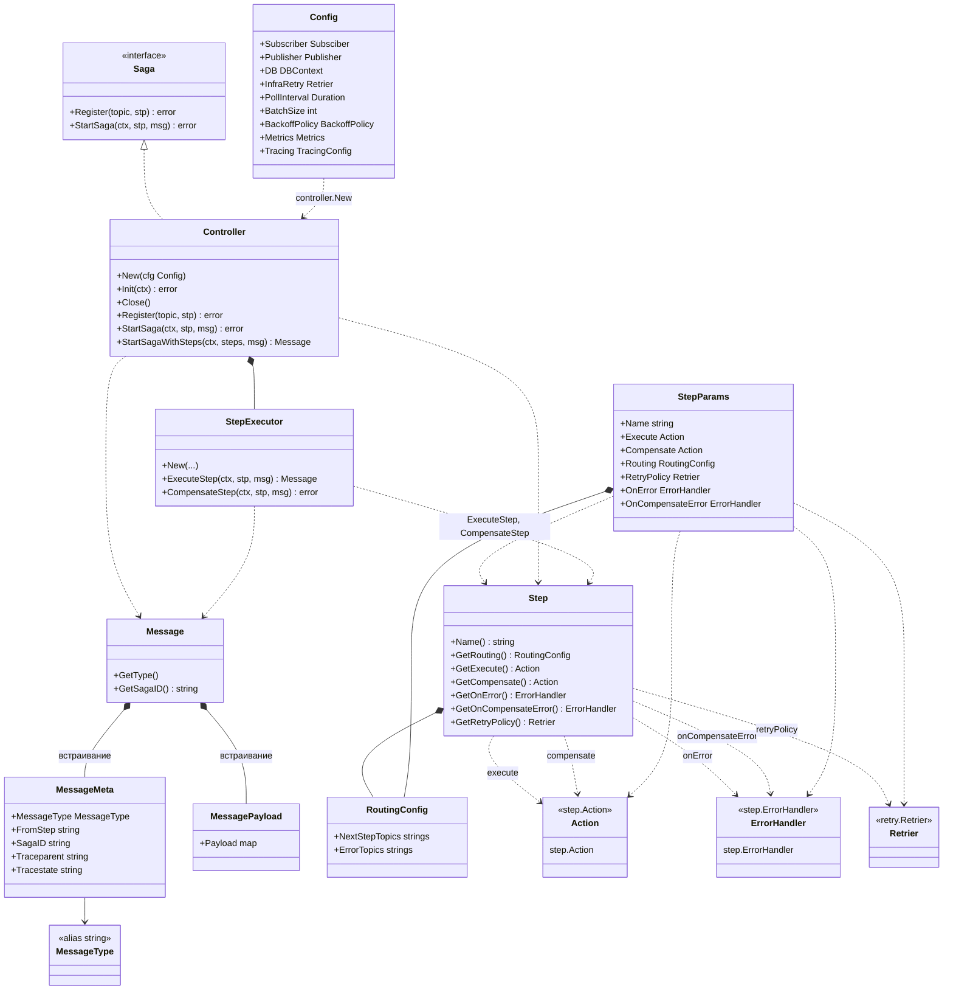
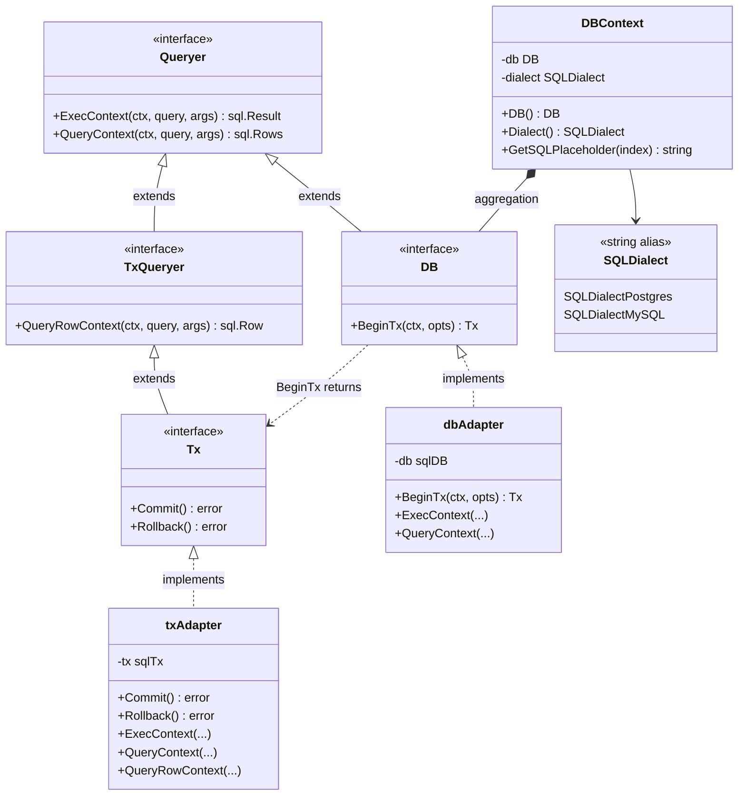

### 2.2. Архитектура библиотеки

#### 2.2.1. Высокоуровневое описание архитектуры
Сформированные требования диктуют и архитектуру системы. Самым главным решением является то, что библиотека создана для реализации именно хореографических саг.

Выбор хореографии объяснен следующией причине. Как было описано ранее одним из функциональных требований является легкость внедрения, хореографическая сага позволяет использовать уже существующию систему, без внедрения в нее дополнитльного узла координатора и не навязывать отдельную платформу исполнения, что соответствует требованию легковесности. 

Однако это накладывает и определенные ограничения. Библиотека будет полезной только для систем, которые уже используют событийно-ориентированное взаимодействие или могут быть естественным образом к нему адаптированы, то есть те системы в которых уже есть настроенный брокер сообщений. В ином случае придется разворачивать этот узел, так как от брокера зависит координация сообщений и их асинхронная доставка. Кроме того, вместе с преимуществами хореографии библиотека наследует и ее характерные сложности, которые были описаны в анализе предметной области: 
 1. отсутствие единой точки управления
 2. необходимость идемпотентной обработки
 3. зависимость от надежности обмена сообщениями и более сложное восстановление после частичных отказов. 
 
 Тем не менее именно такой компромисс позволяет реализовать распределенную транзакцию как легковесную библиотеку.

#### 2.2.2. Инверсия управления

В основе архитектуры библиотеки лежит принцип инверсии управления. По такому принципу часто строят различные фреймворки, например Django, Spring, его идея в том, что пользователь не управляет вручную всем жизненным циклом выполнения распределенного шага, а передает библиотеке контроль над инфраструктурной частью процесса. В случае текущего продука, этот принцип раскрывается так: разработчик описывает бизнес-логику шага, компенсационное действие, структуру сообщений и прикладную реакцию на ошибки, тогда как библиотека берет на себя координацию выполнения, связанную с приемом входящего сообщения, обеспечением идемпотентности, запуском шага в транзакции.

// подумать включать ли это
Такое распределение ответственности позволяет четко отделить прикладной уровень от инфраструктурного. Пользователь работает с сущностями предметной области, не дублируя в каждом сервисе одинаковую логику по управлению транзакцией, маршрутизации сообщений, повторной доставке и фиксации служебного состояния. Библиотека, в свою очередь, реализует единый жизненный цикл выполнения шага и тем самым стандартизирует обработку распределенного процесса во всех сервисах, в которые она интегрируется.

// подумать включать ли это
Однако такой подход связан и с архитектурным компромиссом. С одной стороны, разработчик получает более простой, единообразный и расширяемый способ работы с сагой. С другой стороны, он должен следовать жизненному циклу выполнения, задаваемому библиотекой, и учитывать ограничения, связанные с ее внутренней моделью обработки шагов. Иными словами, гибкость на уровне низкоуровневой инфраструктурной логики частично ограничивается ради достижения единообразия, повторного использования и снижения сложности интеграции.

#### 2.2.3. Публичный API и доменные абстракции
Пользовательский интерфейс библиотеки строится вокруг ограниченного набора доменных абстракций, через которые описывается выполнение распределенного процесса. Ключевыми сущностями являются `Saga`, `Step`, `Action`, `Message`, `Controller` и `Executor`. 

* "Saga" в коде представлена одноименным интерфейсом верхнего уровня. Эта абстракция задает минимальный контракт управления распределенным процессом: регистрацию шага на входящем топике через `Register` и запуск новой саги через `StartSaga`. В текущей реализации данный интерфейс реализуется структурой `Controller`.

* Одной из центральных абстракций является "Step": 
Представляет собой структуру, в которой пользователь описывает бизнес логику шага распределенной транзакции. Таким образом строя сагу. Шаг можно "привязать" к определенному топику через структуру "Controller", а также указать топики, в которые будут отправлены сообщения при ошибке (топики компенсации) или при удачном исходе шага, то есть топики для следующих шагов. Описывая марщрутизацию шага можно строить гибкие пути между сервисами.

Структура шага и связанные с ней абстракции показаны на UML-диаграмме ниже.

* Сущность "Action" (действие) представляет собой тип функций, которыми оперерирует шаг. Бизнес действие описывается пользователем в соотвествии с сигнатурой, которую задает "Action", именно в функции Action пользователь должен описать действия которые будут выполнены в рамках локальной транзакции или в рамках компенсации. То есть для "Step" "Action" является единицей действия. Эта сущность диктует пользователю дизайн бизнес шага. Получив сообщение от другого сервиса и проведя десериализацию "Step" вызовет действие передав все параметры. 

Язык Go предоставляет возможность создать пользовательский тип на основе встроенного типа, в этом случае - функции. Чтобы создать "Action" пользователь должен имплементировать функцию с такой сигнатурой и поместить ее внутри шага.
    type Action func(ctx context.Context, tx database.TxQueryer, msg message.Message) (message.Message, error)

В результате выполнения функция возвращает новое сообщение, структуру сообщения формирует пользователь в итоге благодаря этой абстракции библиотека предоставляет довольно интуитивное поведение, человек получает сообщение, выполняет шаг, возвращает сообщение следующему шагу через обычный "return".

* Структура "Message" служит единицей межсервисного обмена и переносит контекст выполнения между участниками процесса. Для наглядности ее состав приведен в таблице.

| Часть структуры | Поле | Назначение |
| --- | --- | --- |
| `MessageMeta` | `MessageType` | Тип сообщения, определяющий характер события: успешное выполнение шага или переход к компенсации. |
| `MessageMeta` | `FromStep` | Имя шага-источника, из которого было отправлено сообщение. |
| `MessageMeta` | `SagaID` | Сквозной идентификатор распределенного процесса, связывающий сообщения в рамках одной `Saga`. |
| `MessageMeta` | `Traceparent` | Служебное поле трассировки в формате `W3C Trace Context`. |
| `MessageMeta` | `Tracestate` | Дополнительное поле трассировки для передачи контекста наблюдаемости. |
| `MessagePayload` | `Payload` | Полезная нагрузка сообщения с прикладными данными. |

Так как служебная информация всегда имеет одинаковую структуру, за ее декодирование отвечает библиотека, однако заполнение и декодирование полезной нагрузки остается в зоне отвественности пользователя. По сети Message передается в формате JSON

* "Controller" выступает внешней точкой входа в библиотеку. Он отвечает за инициализацию библиотеки и следующие настроки:
    * используемый брокер сообщений
    * используемая база данных
    * использование наблюдаемости и логирование
    * использования логики повторения запросов 
регистрацию шагов на входящих топиках, запуск фоновых процессов и связывание пользовательского описания шага с инфраструктурным механизмом исполнения. Через `Controller` библиотека подключается к прикладному сервису и встраивается в его жизненный цикл. В этом смысле `Controller` представляет собой фасад верхнего уровня, через который пользователь конфигурирует библиотеку и передает управление обработкой сообщений ее внутренним компонентам.

* "Executor"
Внутреннее выполнение шага делегируется сущности `Executor`. Именно `Executor` управляет запуском бизнес-логики шага в транзакции, записью результата в `Outbox`, применением retry-механизмов и переходом к компенсирующему сценарию при ошибке.

В совокупности перечисленные сущности формируют основной пользовательский API библиотеки. Они позволяют описывать распределенный процесс на уровне шагов, сообщений и обработчиков, не опускаясь до ручного управления транспортом, транзакциями и служебным состоянием.

// вместо этого вставить UML

#### 2.2.4. Инфраструктурные абстракции
Одной из проблем, которую необходимо было решить при реализации продукта была независимость от конкретных СУБД и брокеров, чтобы библиотека не была заточена под конкретный стэк.
Для того чтобы библиотека могла встраиваться в разные прикладные сервисы, ее взаимодействие с внешней инфраструктурой строится не через конкретные реализации, а через набор узких интерфейсов. Это позволяет не приявазываться к конкретному брокеру сообщений или базе данных.

Для независимости от брокера выделены интерфейсы "Publisher" и "Subsciber" и объединяющий их "Pubsub". Они задают минимальный контракт для публикации события в топик и подписки на входящий поток сообщений. Благодаря этому `Controller` при инициализации зависит только от контрактов, а не от конкретного транспорта. Это особенно важно для хореографической саги, где обмен сообщениями выступает основным механизмом координации шагов.

Аналогичным образом организован слой доступа к данным. Для этого определены интерфейсы, которые описывают операции выполнения запросов, чтения строк и управления транзакцией. Эти абстракции позволяют внутренним компонентам библиотеки, работать с базой через единый контракт. Пользовательский обработчик шага также получает не конкретную транзакцию драйвера, а интерфейс, что позволяет выполнять бизнес-запросы внутри локальной транзакции без зависимости от конкретной библиотеки доступа к данным.

Библиотека хранит сведения о диалекте СУБД. За счет этого учитывается различия в запросах между разными базами данных.

// это можно не включать
Состав интерфейсов и их связи показаны на UML-диаграмме ниже. Базовый интерфейс `Queryer` описывает операции выполнения запросов без возврата строки, его расширяет `TxQueryer` за счет `QueryRowContext`, а `Tx` дополнительно вводит `Commit` и `Rollback` для управления жизненным циклом транзакции. Интерфейс `DB` представляет соединение с базой и умеет открывать транзакцию через `BeginTx`. Конкретные адаптеры `dbAdapter` и `txAdapter` оборачивают стандартные `sql.DB` и `sql.Tx` и реализуют соответствующие интерфейсы. Структура `DBContext` агрегирует `DB` и значение `SQLDialect`, тем самым связывая соединение с диалектом и позволяя библиотеке формировать корректные плейсхолдеры и миграции для разных СУБД.

// это можно не включать
Такое разделение интерфейсов отражает уровни ответственности: `Queryer` описывает общие операции запросов, `TxQueryer` добавляет доступ к одной строке и используется пользовательским обработчиком шага, `Tx` управляет фиксацией транзакции внутри библиотеки, а `DB` служит точкой открытия новой транзакции. Пользовательский `Action` зависит только от `TxQueryer` и не имеет доступа к `Commit` или `Rollback`, что исключает случайное нарушение транзакционного контура со стороны прикладной логики.

С архитектурной точки зрения это решение реализует принцип инверсии зависимостей: верхнеуровневые компоненты библиотеки не знают, какой именно брокер или драйвер БД используется в конкретном приложении. Благодаря этому пользователь может подключить готовую реализацию либо создать собственный адаптер, если библиотека не поддерживает нужный стек из "коробки". Тем самым достигаются расширяемость, переносимость и упрощение интеграции.

У выбранного подхода есть и ограничение. Хотя библиотека абстрагирует работу с хранилищем, она опирается на модель Go библиотеку `database/sql`, которая может работать не со всеми базами. Следовательно, текущая реализация ориентирована именно на реляционные базы данных и не претендует на универсальную поддержку произвольных типов хранилищ.  

#### 2.2.5. Транзакционность шага и управление транзакцией
Еще одну проблему которую было необходиом решить - это абстрагирование пользователя от логики транзакций, чтобы сделать API легче для разработчка, таким образом пользователь мог бы описать все действия именно в виде функции в шаге 

Поэтому было принято решение сделать выполнение каждого шага внутри единой локальной транзакции базы данных. Открытие транзакции, запуск пользовательского обработчика, запись результата в outbox таблицу и фиксация транзакции образуют неделимую операцию. Если любая из этих операций завершается неудачей, транзакция откатывается целиком, и ни результат бизнес-логики, ни исходящее сообщение не сохраняются в хранилище, что обеспечивает консистентность на уровне локальных транзакций и соотвественно на уровне всей саги.

Управление транзакцией остается на стороне библиотеки. Пользователю не нужно самому открывать транзакцию, не нужно следить за ее фиксацией или откатом и не нужно знать о записи о получении и отпрвке событий. Пользователь получает уже готовый транзакционный контекст и работает только с прикладной логикой. 

// нужно будет перенести в раздел с надежностью
Для случаев когда инфраструктурные операции завершаются временными ошибками, например `BeginTx`, `WriteMessages` или `Commit`, возвращается `retry.RetryableError`. Это позволяет `infraRetrier` в `StepExecutor` повторить попытку выполнения всей атомарной операции целиком. Тем самым гарантируется, что транзиентные сбои брокера или базы данных не приводят к потере шага, а дают ему возможность успешно завершиться при следующей попытке.

#### 2.2.6. Маршрутизация и схема движения сообщений
- Пользователь задает конфигурацию маршрутизации, определяющую топики, направления передачи сообщений и связь между шагами распределенного процесса.
- Существенным элементом маршрутизации выступает `saga_id`, позволяющий связать отдельные сообщения в рамках одного бизнес-процесса.
- Библиотека берет на себя прием входящих сообщений, сопоставление их со сценариями обработки и публикацию исходящих событий.
- Пользователь получает возможность декларативно описать путь сообщений, не реализуя вручную транспортную обработку и связывание событий между сервисами.
- Проблема, которую решает: отделение бизнес-логики от логики межсервисной доставки и предоставление пользователю единой схемы описания пути сообщений.
- Связь с требованиями из `proektirovanie.md`: поддержка сквозного идентификатора распределенной транзакции, возможность интеграции с брокерами сообщений, возможность настройки координации для успешного и компенсационного сценариев, простота интеграции, расширяемость.

#### 2.2.7. Механизм выполнения шага `Saga`
- Выполнение шага начинается с приема входящего сообщения и его проверки.
- Перед запуском бизнес-логики библиотека проверяет сообщение через `Inbox`, чтобы исключить повторную обработку одного и того же шага.
- После этого выполняется локальная бизнес-операция пользователя.
- При успешном завершении формируется исходящее сообщение, которое сохраняется в `Outbox` в рамках той же локальной транзакции.
- Публикация сообщения в брокер осуществляется отдельным фоновым механизмом чтения `Outbox`.
- В этом пункте необходимо описать входные точки библиотеки и полный процесс выполнения шага внутри одного сервиса.
- Проблема, которую решает: гарантированное и воспроизводимое выполнение отдельного шага распределенного процесса без смешения бизнес-логики с инфраструктурной обработкой сообщений.
- Связь с требованиями из `proektirovanie.md`: возможность описания шага саги, автоматическая обработка успешного завершения шага и ошибки, возможность интеграции с брокерами сообщений, наличие встроенных алгоритмов надежности.

#### 2.2.8. Обеспечение надежности и устойчивости
- Библиотека разделяет инфраструктурные ошибки и бизнес-ошибки.
- Для инфраструктурных ошибок используются retry-механизмы, ориентированные на eventual success при временных сбоях транспорта, брокера или БД.
- Для бизнес-ошибок библиотека предоставляет возможность описать собственную прикладную реакцию и компенсационное поведение.
- `Inbox` и `Outbox` выступают базовыми механизмами надежной доставки, дедупликации и устойчивости к частичным отказам.
- Дополнительно учитываются повторная доставка, идемпотентная обработка, компенсационные сообщения и поддержка обратного хода `Saga`.
- Проблема, которую решает: обеспечение устойчивого выполнения распределенного процесса в условиях частичных отказов, повторной доставки сообщений и необходимости компенсации.
- Связь с требованиями из `proektirovanie.md`: надежность и отказоустойчивость, автоматическая обработка ошибки шага и перехода к компенсирующему сценарию, наличие встроенных алгоритмов устойчивости при отказах, возможность пользовательской логики обработки ошибок.

#### 2.2.9. Наблюдаемость и средства контроля выполнения
- Библиотека предусматривает встроенные средства логирования, трассировки и сбора метрик `Prometheus`.
- Наблюдаемость должна позволять установить, на каком шаге находится `Saga`, где произошел сбой, была ли запущена компенсация и в какой момент времени возникло отклонение.
- Эти данные необходимы не только для оперативной диагностики, но и для последующего ручного анализа и восстановления консистентности.
- Проблема, которую решает: обеспечение прозрачности состояния `Saga` и возможности анализа причин отказа при восстановлении после сбоя.
- Связь с требованиями из `proektirovanie.md`: наблюдаемость и прозрачность процесса, надежность и отказоустойчивость.

#### 2.2.10. Хранение состояния и структура таблиц
- Библиотека остается `stateless` на уровне собственного управляющего процесса и переносит критически важное состояние в инфраструктурные таблицы базы данных.
- Для этого создаются таблицы `outbox` и `inbox`, используемые для надежной публикации сообщений и дедупликации входящих событий.
- В разделе следует описать подход к созданию таблиц для разных SQL-СУБД и ограничения, связанные с поддерживаемыми диалектами.
- Необходимо отдельно показать структуру таблиц `outbox` и `inbox`, а также пояснить роль их полей в обеспечении надежности.
- В этом пункте уместно привести `ERD`-диаграмму.
- Проблема, которую решает: хранение инфраструктурного состояния, необходимого для надежной доставки сообщений, дедупликации и восстановления после частичных отказов.
- Связь с требованиями из `proektirovanie.md`: надежность и отказоустойчивость, расширяемость, корректность и атомарность бизнес-шага.

#### 2.2.11. Полный путь взаимодействия пользователя с библиотекой
- В этом подпункте следует описать последовательность действий пользователя: подключение библиотеки, определение шагов, настройка маршрутизации, подключение адаптеров, запуск обработки и эксплуатация.
- Следует показать полный путь от точки входа в библиотеку до выполнения распределенного процесса.
- Подпункт нужен для демонстрации того, что библиотека представляет собой целостный сценарий интеграции, а не набор разрозненных компонентов.
- Проблема, которую решает: снижение сложности освоения библиотеки и демонстрация воспроизводимого сценария ее использования в прикладном сервисе.
- Связь с требованиями из `proektirovanie.md`: простота интеграции, возможность описания шага саги, возможность интеграции с брокерами сообщений, наличие пользовательской логики обработки ошибок.

#### 2.2.12. Use case-диаграмма и входные точки библиотеки
- Диаграмма вариантов использования должна показать, какие действия выполняет пользователь библиотеки и какие точки входа предоставляет система.
- На диаграмме следует отразить определение шага, настройку маршрутов, запуск обработки, обработку ошибок и наблюдение за состоянием процесса.
- Диаграмма нужна как внешнее представление границ библиотеки и ее взаимодействия с разработчиком и инфраструктурой.
- Проблема, которую решает: формализация сценариев использования библиотеки и уточнение границ ответственности между пользователем, библиотекой и внешними системами.
- Связь с требованиями из `proektirovanie.md`: простота интеграции, наблюдаемость, расширяемость.

#### 2.2.13. Диаграммы последовательности выполнения `Saga`
- В разделе необходимо привести диаграммы последовательности для успешного сценария выполнения.
- Отдельно следует показать сценарий с ошибкой и запуском компенсации.
- Дополнительно следует отразить публикацию сообщения через `Outbox`, а также сценарий повторной доставки и идемпотентной обработки.
- Эти диаграммы должны фиксировать динамику взаимодействия между сервисом, библиотекой, брокером сообщений и хранилищем состояния.
- Проблема, которую решает: наглядное представление временной динамики распределенного процесса и различий между нормальным и компенсационным сценарием выполнения.
- Связь с требованиями из `proektirovanie.md`: автоматическая обработка успешного завершения шага и ошибки, поддержка компенсирующего действия, надежность и отказоустойчивость, наблюдаемость.
